# M&A Company Research & Document Intelligence

An evidence-grounded document-intelligence system for researching companies from annual
reports, filings, investor presentations, and related PDFs. It turns source documents into
retrievable evidence, citation-backed answers, and typed M&A-oriented company research while
keeping document and page provenance inspectable.

Project 1 is complete at version **1.0.0** and forms the document-research foundation of the
[AI × M&A Deal Intelligence portfolio](../README.md).

## What it does

- Parses local text-oriented PDFs into stable document and page models.
- Preserves physical page index, canonical citation page, source identity, and parser warnings.
- Builds deterministic, page-aware chunks with externally supplied research metadata.
- Generates OpenAI embeddings and persists complete vector records in SQLite.
- Retrieves ranked evidence through exact cosine similarity and explicit metadata filters.
- Produces evidence-constrained answers with explicit insufficient-evidence behavior.
- Resolves model-selected evidence IDs into validated document/page citations.
- Generates an 11-section typed company research profile with section-level evidence.
- Evaluates retrieval, generation, grounding, citations, abstention, and structured outputs.
- Exposes the complete workflow through a validated FastAPI interface.

## Why it matters in M&A

Analysts need more than a fluent summary. Revenue may refer to a specific fiscal period and
currency; EBITDA may be adjusted or reported; a risk may be material only in a particular
filing; and every conclusion should be traceable to evidence. This project keeps those source
relationships throughout the pipeline so a user can inspect why an answer was produced.

It supports initial company research and document review. It does not replace investment
bankers, due-diligence professionals, legal review, or independent verification.

## Architecture

```mermaid
flowchart LR
    PDF[Company PDF] --> Parser[PyMuPDF parser]
    Parser --> Pages[Parsed pages + provenance]
    Pages --> Chunker[Structural chunker]
    Chunker --> Chunks[DocumentChunk objects]
    Chunks --> Embedder[OpenAI embedder]
    Embedder --> Store[(SQLite vector store)]
    Store --> Retriever[Cosine retriever]
    Retriever --> Context[Bounded evidence context]
    Context --> LLM[Structured generator]
    LLM --> Answer[Grounded answer]
    Answer --> Citations[Validated citations]
```



Structured research uses fixed category-specific retrieval queries, deduplicates a bounded
evidence catalog, and validates one typed synthesis containing facts, separately labeled
observations, qualified financial metrics, insufficiency states, and citations.

See [final architecture diagrams](docs/architecture.md#final-system-diagrams) for indexing,
RAG, structured research, and evaluation views.

## Technical stack

| Area | Implementation |
| --- | --- |
| Language | Python 3.11+ with strict MyPy checks |
| PDF parsing | PyMuPDF behind a project-owned adapter |
| Domain models | Frozen standard-library dataclasses |
| API schemas | Pydantic 2 |
| Embeddings | OpenAI `text-embedding-3-small`, 1,536 dimensions |
| Vector persistence/search | SQLite records and exact cosine similarity |
| Generation | OpenAI Responses API through provider-neutral interfaces |
| API | FastAPI and Uvicorn |
| Evaluation | Versioned JSON dataset, deterministic metrics, optional LLM judge |
| Quality | pytest, Ruff, MyPy, GitHub Actions |
| Packaging | `pyproject.toml`, console commands, minimal Docker image |

LangChain, LangGraph, multi-agent orchestration, web search, and a frontend are intentionally
absent because the implemented workflow does not require them.

## Quick demo

Create the fictional, copyright-safe five-page sample:

```powershell
madi-create-demo-pdf
```

Then start the API, index it, ask a question, generate research, and run evaluation by following
the [reproducible demo](docs/demo.md).

Example question:

> What were FY2025 revenue and adjusted EBITDA?

Typical grounded result:

> FY2025 reported revenue was USD 125 million and adjusted EBITDA was USD 18 million. [1]

> [1] FY2025 Synthetic Annual Report — pp. 2–3

Exact model prose can vary. The cited values and qualifiers must resolve to retrieved evidence.

## Structured research output

The research endpoint returns these sections when supported:

- company/source context;
- business overview;
- products and services;
- business segments;
- geographic exposure;
- customers and end markets;
- financial highlights;
- major risks;
- strategic developments;
- management outlook;
- M&A-relevant observations.

Abbreviated example:

```json
{
  "company_name": "Apex Industrial Analytics",
  "sections": [
    {
      "key": "financial_highlights",
      "facts": [],
      "observations": [],
      "financial_metrics": [
        {
          "metric_name": "Revenue",
          "value": "USD 125 million",
          "fiscal_period": "FY2025",
          "currency": "USD",
          "basis": "reported revenue",
          "citations": ["..."]
        }
      ],
      "insufficient_evidence": false
    }
  ]
}
```

Facts and analytical observations remain distinct. The application does not calculate or fill
missing financial values merely because a section expects them.

## Evaluation

The committed synthetic benchmark contains 14 questions, including one deliberately
unanswerable question, and two structured profiles. Its recorded observations intentionally
contain defects so the framework proves that it can identify retrieval, grounding, citation,
and structured-output failures.

| Component | Final deterministic result |
| --- | ---: |
| Retrieval Hit@1 / Hit@3 / Hit@5 | 76.92% / 84.62% / 92.31% |
| Retrieval Recall@1 / Recall@3 / Recall@5 | 73.08% / 80.77% / 88.46% |
| Retrieval MRR | 82.69% |
| Retrieved-context fact recall | 78.57% |
| Gold-context fact recall | 92.86% |
| Abstention accuracy | 85.71% |
| Claim support rate | 85.71% |
| Citation validity / support precision / coverage | 92.86% / 75.00% / 78.57% |
| Structured financial-field accuracy | 95.83% |

The M11 rerun is identical to the M8 baseline because finalization did not alter the recorded
dataset, runtime prompts, retrieval observations, or metric definitions. These numbers measure
the small synthetic fixture and are not a claim about all public-company filings.

See [evaluation methodology and complete results](docs/evaluation.md).

## Setup

From `01_company_document_intelligence/`:

```powershell
python -m venv .venv
.venv\Scripts\Activate.ps1
python -m pip install --upgrade pip
python -m pip install -e ".[dev]"
Copy-Item .env.example .env
```

The application requires Python 3.11 or newer. It does not auto-load `.env`; export values in
your shell or inject them with a process/container manager. Provider-backed commands require:

```powershell
$env:OPENAI_API_KEY = "your-key"
```

`.env.example` documents every supported variable without containing a real secret. Raw PDFs,
generated indexes, evaluation outputs, environments, and caches are ignored by Git.

## API

Start locally:

```powershell
madi-api
```

Core endpoints:

| Method | Path | Responsibility |
| --- | --- | --- |
| `GET` | `/health` | Process liveness without provider initialization |
| `POST` | `/v1/documents/index` | Parse, chunk, embed, and upsert a root-constrained PDF |
| `POST` | `/v1/answers` | Grounded Q&A with citations and supporting evidence |
| `POST` | `/v1/research` | Typed structured company research with section evidence |

Interactive OpenAPI documentation is available at `http://127.0.0.1:8000/docs`. Request
examples and the stable error envelope are documented in
[API and robustness](docs/api-robustness.md).

## Developer commands

```text
madi-create-demo-pdf  Create the fictional demonstration PDF
madi-inspect-pdf      Parse a PDF and inspect bounded page output
madi-inspect-chunks   Parse and inspect bounded chunk output
madi-build-index      Build or update the persistent vector index
madi-retrieve         Inspect ranked semantic evidence
madi-answer           Run grounded Q&A from a local PDF
madi-research         Generate the structured company profile
madi-evaluate         Run component-level quality evaluation
madi-api              Serve the HTTP application
```

Each command supports `--help`. CLI previews are bounded and do not print vectors, secrets, or
complete large documents.

## Running tests

```powershell
python -m pytest
python -m ruff check .
python -m ruff format --check .
python -m mypy
```

GitHub Actions runs the same checks for relevant pull requests and pushes to `main`.
For this single-maintainer portfolio, the recommended `main` ruleset requires pull requests and
the `quality` check, blocks force pushes and branch deletion, requires resolved conversations,
and permits squash merge for a linear history. Repository-host settings must be configured on
GitHub; the workflow file cannot enforce them by itself.

## Running evaluation

```powershell
madi-evaluate --dataset evaluation/datasets/synthetic_company_v1.json `
  --output-dir artifacts/evaluation --report-stem local-run --top-k 1,3,5
```

Normal evaluation is deterministic, offline, and free of provider calls. `--llm-judge` adds an
optional paid structured judge when `OPENAI_API_KEY` is present; its assessment remains
separate from deterministic metrics.

## Deployment

The primary deployment path is a single container on a trusted host with mounted document and
index directories:

```powershell
docker build -t madi-company-intelligence:1.0.0 .
```

See [deployment and reproducibility](docs/deployment.md) for the run command, persistence,
security boundary, and honest hosted-platform limitations.

## Documentation

- [Architecture](docs/architecture.md)
- [Reproducible demo](docs/demo.md)
- [Deployment and reproducibility](docs/deployment.md)
- [Portfolio and interview guide](docs/portfolio-interview-guide.md)
- [Final validation record](docs/final-validation.md)
- [Technical decisions](docs/decisions.md)
- [Progress log](docs/progress.md)
- [PDF ingestion](docs/ingestion.md)
- [Metadata and chunking](docs/chunking.md)
- [Embeddings and vector indexing](docs/embeddings-indexing.md)
- [Semantic retrieval](docs/semantic-retrieval.md)
- [Grounded RAG](docs/grounded-rag.md)
- [Citations and structured research](docs/citations-structured-research.md)
- [Evaluation](docs/evaluation.md)
- [API and hardening](docs/api-robustness.md)

## Limitations

- Plain-text PDF extraction does not provide OCR or reliable understanding of complex tables,
  charts, or every multi-column layout.
- Printed page labels are not inferred; citations use one-based canonical PDF pages.
- General embeddings can miss specialized financial language, identifiers, or evidence that
  spans poorly extracted layouts.
- SQLite exact search is transparent but intended for modest local corpora, not distributed or
  high-concurrency workloads.
- Model output can still omit evidence, misread qualifiers, or hallucinate; material conclusions
  require source review.
- The benchmark is small, synthetic, and based on recorded observations rather than a live
  provider run over a representative set of public filings.
- Provider-backed workflows incur API cost and latency.
- The API has no authentication, file upload, TLS termination, or rate limiting and should not
  be exposed publicly as-is.
- The system has no live web/company discovery, real-time market data, valuation engine, or
  autonomous M&A decision-making.
- PyMuPDF licensing must be reviewed before commercial distribution.

## Future work

Project 2 will extend these foundations into M&A target screening and deal sourcing. Likely
reusable boundaries are documented in the
[portfolio and interview guide](docs/portfolio-interview-guide.md), but code remains inside
Project 1 until a second concrete consumer justifies extraction into `shared/`.
