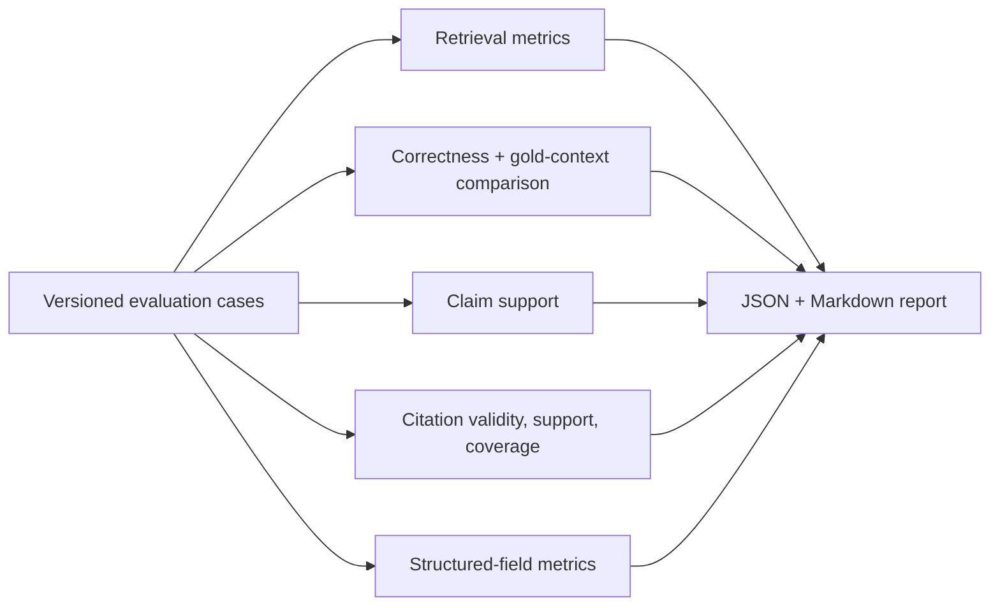
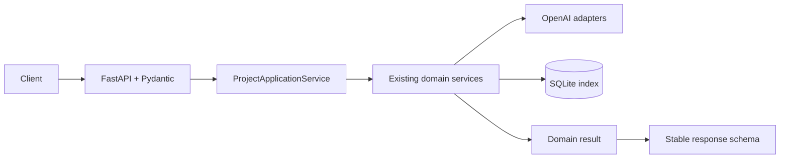

# V1 architecture

## Architectural goal

Build a modular pipeline that turns company documents into traceable evidence and then into
answers or structured research. Each stage should expose a small Python boundary and exchange
provider-neutral domain models. This lets later M&A projects reuse document processing and
retrieval without inheriting a particular UI, LLM, or vector database.

## Implemented data flow

```text
Source documents
    │
    ▼
Document intake and parsing
    │  page-level text + source metadata
    ▼
Normalization and document representation
    │  normalized text with provenance retained
    ▼
Chunking
    │  stable chunks with document/page/section lineage
    ▼
Embedding and vector index
    │
    ▼
Candidate retrieval ──► optional reranking
    │
    ▼
Context construction
    │  token-bounded evidence bundle
    ▼
Grounded generation
    ├──► free-form answer with citations
    └──► schema-validated company research
             │
             ▼
Evaluation across retrieval, grounding, answers, citations, and abstention
```

## Implemented components

### Domain models

Provider-neutral typed models will represent source documents, pages or logical elements,
chunks, retrieval results, evidence bundles, answers, citations, and evaluation examples.
Provenance is part of these models rather than being appended only at answer time.

Candidate metadata includes company, document title, document type, fiscal period, source,
page, section, and chunk ID. Fields remain optional unless the pipeline can derive them
reliably. Stable internal IDs will distinguish derived objects from source metadata.

### Document processing

Parsing adapters will convert supported inputs into a canonical document representation.
Normalization will make conservative, inspectable changes. Chunking will operate on that
representation and preserve lineage back to source pages. Parser and chunker choices will be
made with representative documents and measured, rather than assumed during scaffolding.

M1 implements the first part of this boundary. A PyMuPDF adapter accepts local PDFs and returns
immutable `ParsedDocument` and `ParsedPage` models. Third-party objects do not cross the
ingestion boundary. Each page carries its content-derived document ID, source reference,
zero-based physical PDF index, and one-based canonical page number. Printed page labels remain
unknown. Pages without extractable text produce explicit warnings.

M2 implements the second part with immutable `DocumentMetadata`, `DocumentChunk`, and
`ChunkedDocument` models plus a provider-neutral `ProvenanceAwareChunker`. It joins nonempty
pages in physical order and applies configurable character-based splitting that prefers
paragraph, line, and word boundaries. Chunks may cross pages and retain an ordered reference
to every page that contributed text. Stable chunk IDs include the parent document identity,
algorithm version, configuration, order, page indexes, and exact text. Optional research
metadata is accepted only from an external caller and is never guessed by the chunker.

### Indexing and retrieval

M3 adds an `Embedder` protocol, an OpenAI `text-embedding-3-small` adapter, immutable
`EmbeddingVector` and `VectorRecord` models, an atomic `ChunkIndexingService`, and a persistent
`SQLiteVectorStore`. Stable chunk IDs are vector-record primary keys. Complete M2 chunks remain
attached to vectors so source, page references, and externally supplied metadata survive
indexing. A manifest prevents provider, model, dimension, and schema mismatches.

SQLite stores inspectable JSON vectors and metadata under ignored `artifacts/`. It does not
provide similarity search or a native approximate-nearest-neighbor index in M3. Retrieval will
be introduced behind a separate boundary in M4, beginning with an exact baseline appropriate
to the measured corpus size. A specialized vector engine will be considered only if scale or
evaluation requires it. Reranking remains deferred until retrieval evaluation shows a gain.

M4 extends the existing store with exact cosine-similarity search and adds a
`SemanticRetriever` boundary. The retriever validates and embeds a query in the same embedding
space as document chunks, applies optional exact filters over stored metadata, and returns
typed `RetrievalResult` objects ordered by descending similarity. Results retain the complete
M2 chunk, so source and page provenance do not depend on a later prompt or citation stage.
Equal scores use stable chunk IDs for deterministic ordering. Search remains an exact linear
scan suitable for the current local corpus; reranking and answer generation remain deferred.

### Answering and structured research

M5 implements the first answering layer with a provider-neutral `Generator`, deterministic
`ContextBuilder`, and `GroundedRAGService`. The service consumes M4 `RetrievalResult` objects
instead of reaching into storage. It preserves rank order, includes stable source/chunk/page
identifiers, and admits only complete evidence blocks under explicit chunk and character
limits. The OpenAI adapter uses the Responses API and a schema-validated answer containing an
answer string, an insufficient-evidence flag, and selected evidence IDs.

No retrieval result causes deterministic abstention without an API call. If evidence is
present but weak, the prompt requires abstention and the structured flag lets application
code normalize the response to a stable insufficiency statement. The returned `RAGAnswer`
retains only the retrieval results actually placed in context.

M6/7 adds deterministic citation mapping and structured company research. Model-visible
evidence IDs are resolved only against the exact supplied context; unknown IDs fail and only
selected supporting chunks become citations. A fixed `ResearchEvidenceCollector` runs one
targeted query for each of 11 research categories, deduplicates chunks into a bounded evidence
catalog, and makes one schema-validated synthesis request. Application-owned models separate
source facts from analytical M&A observations, preserve financial period, unit, currency, and
basis, and require section-local citations or an explicit insufficient-evidence state.

### Evaluation

M8 implements evaluation as a separate package over versioned cases and recorded observations.
It computes retrieval hit/recall at configurable ranks, MRR, expected-fact correctness,
claim-to-context faithfulness, citation validity/support/coverage, and structured-field quality
without introducing gold data into production code. Retrieved-context and gold-context answers
are scored separately so an observed gap can identify retrieval/context contribution.

The runner emits machine-readable JSON plus a compact Markdown report containing separate
component metrics, per-category summaries, per-case evidence and failures, and a stable failure
taxonomy. Its default synthetic benchmark and normal tests require no network or paid API. An
optional provider-isolated structured LLM judge can supplement deterministic measures when
credentials are deliberately supplied; its score is never merged into a composite metric.

### API and application composition

M9/10 adds a FastAPI transport over a reusable `ProjectApplicationService`. HTTP routes validate
and translate data but do not parse PDFs, create embeddings, retrieve evidence, build prompts,
or call models directly. A small lazy container constructs provider clients once when a
provider-dependent endpoint is first used. The application facade opens the SQLite store per
operation, composes the stable M1–M7 services, and returns domain results for conversion into
explicit response schemas.

```text
client -> FastAPI/Pydantic -> application facade -> existing domain services -> providers/store
                                   |
                                   +-> domain result -> response schema
```

The transport assigns request IDs, records bounded operational events, rejects unsafe paths and
oversized inputs, and maps expected exception families into a stable error envelope. API error
messages omit underlying exception text so local paths and provider diagnostics remain in
server-side logs. Provider calls use explicit timeouts and bounded SDK retries; deterministic
validation and parsing are never retried.

## V1 technical stack

- **Python 3.11+** for typing support and ecosystem compatibility.
- **Frozen standard-library dataclasses** for domain schemas. They provide explicit validation,
  type checking, and immutable value objects without a runtime schema dependency at this stage.
- **PyMuPDF** for M1 PDF validation and plain-text extraction. It offers mature page-aware
  parsing with a small direct API; its AGPL/commercial licensing and layout limitations must be
  considered before commercial distribution.
- **pytest** for tests, **Ruff** for linting/formatting, and **mypy** for static type checking.
- **OpenAI `text-embedding-3-small`** behind a provider-neutral adapter, using 1,536 dimensions
  by default. It is a low-cost general retrieval baseline whose financial-domain quality will
  be measured later.
- **SQLite vector-record persistence** for V1. It is transactional, inspectable, and requires
  no service. M4 evaluation will determine whether a native vector engine is warranted.
- **OpenAI `gpt-6-luna`** with low reasoning effort behind a provider-neutral generator. It is
  a cost-conscious baseline for focused evidence synthesis; later evaluation must compare it
  with stronger models before production use.
- **Pydantic** at external boundaries for OpenAI Structured Outputs and HTTP request/response
  validation. Provider-neutral domain objects remain frozen standard-library dataclasses.
- **FastAPI and Uvicorn** for the local programmatic interface, with Pydantic transport schemas
  kept separate from frozen provider-neutral domain models.

LangChain or LlamaIndex may be used later for a narrow capability if they reduce maintenance
without obscuring provenance or evaluation. The core domain models and pipeline boundaries
should not depend on them. LangGraph and multi-agent orchestration are outside V1 unless a
future requirement demonstrates a real need.

## Package boundaries

The implemented boundaries are `domain`, `ingestion`, `chunking`, `indexing`, `retrieval`,
`generation`, `rag`, `citations`, `research`, `evaluation`, `application`, and `api`. Each maps
to a concrete responsibility; the project avoids empty abstractions created for anticipated
future work.

## Cross-cutting constraints

- Raw source data and generated indexes remain outside Git.
- Identical input plus configuration should produce stable document and chunk identifiers.
- Page numbers must distinguish source labels from zero-based internal indexes when both exist.
- Logs and evaluation artifacts must make failures inspectable without exposing secrets.
- Absence of evidence is a supported outcome, not an invitation to fill gaps from model memory.

## Final system diagrams

These diagrams describe the implemented Project 1 version 1.0.0 boundaries.

### Ingestion and indexing

```mermaid
flowchart LR
    PDF[Local PDF] --> Validate[Type, path, size validation]
    Validate --> Parser[PyMuPDF adapter]
    Parser --> Pages[ParsedDocument + ordered ParsedPage objects]
    Pages --> Normalize[Conservative normalization]
    Normalize --> Chunker[ProvenanceAwareChunker]
    Chunker --> Chunks[Ordered DocumentChunk objects]
    Chunks --> Embedder[Embedder batch interface]
    Embedder --> Records[VectorRecord objects]
    Records --> Store[(SQLiteVectorStore)]
```



Document and chunk IDs are content-derived. Every vector record retains its complete chunk,
trusted metadata, and ordered page references. Re-indexing an unchanged chunk upserts the same
primary key.

### Grounded question answering


The generator can select only evidence IDs supplied in context. Deterministic mapping rejects
unknown identifiers and never manufactures missing page provenance.

### Structured company research


The profile separates facts, M&A-relevant observations, and qualified financial metrics.
Unsupported sections remain explicitly insufficient.

### Evaluation



Metrics remain separate so a reviewer can distinguish retrieval, context, generation,
citation, and structured-output failures. Evaluation data never enters runtime prompts.

### API composition



The transport owns HTTP validation and safe errors. It does not duplicate parsing, retrieval,
prompting, citation, or research logic.

