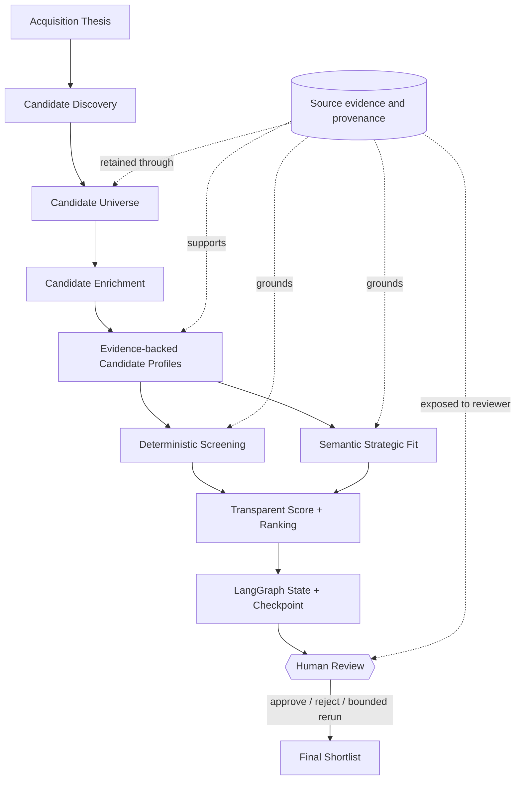

# M&A Target Screening & Deal Sourcing Agent

## Problem

Corporate-development teams often begin with an acquisition thesis rather than a known target.
They must turn strategic intent into a defensible candidate universe, research incomplete company
data, apply measurable constraints, assess qualitative fit, and preserve an audit trail for human
review.

## Why It Matters in M&A

Target sourcing is high-recall research under uncertainty. Search snippets are not verified facts,
missing financial data is not a failure, and strategic fit cannot be reduced to one opaque score.
This project separates sourcing, evidence collection, deterministic decisions, semantic reasoning,
ranking, and human approval so each step is inspectable.

## What the System Does

Given a structured acquisition thesis, Project 2 can:

1. generate transparent discovery queries;
2. source and conservatively deduplicate candidate companies;
3. enrich candidates into evidence-backed profiles;
4. evaluate hard constraints, exclusions, and soft preferences;
5. assess qualitative strategic fit through a grounded provider boundary;
6. produce a deterministic, explainable ranking;
7. pause a checkpointed LangGraph workflow for human review; and
8. return an approved final shortlist through Python or FastAPI.

The default V1 uses synthetic fixtures and requires no network or API key.

## Architecture



LangGraph orchestrates existing services; it does not contain discovery, enrichment, screening,
scoring, or ranking business rules. See [architecture.md](docs/architecture.md).

## Project 1 Integration

Project 1 begins with a known company and supplied documents. Project 2 begins with a thesis and
an unknown candidate universe. Project 2's `Project1DocumentResearchProvider` adapter consumes
Project 1's supported structured research result and maps facts, financials, observations, and
document/chunk/page citations into `CandidateProfile`.

Project 2 does not import Project 1's private retrieval, storage, or provider modules, and it does
not pretend Project 1 automatically obtains candidate documents. Details are in
[project-1-reuse.md](docs/project-1-reuse.md).

## Acquisition Thesis

`AcquisitionThesis` is the validated source of truth. Typed criteria distinguish hard constraints,
soft preferences, exclusions, deterministic versus semantic evaluation, priority or normalized
weight, and financial amount/currency/unit/fiscal period. Incomplete theses are valid. V1 does not
parse natural language into the model. See [acquisition-thesis.md](docs/acquisition-thesis.md).

## Candidate Discovery

The provider-neutral discovery layer generates bounded thesis-aware queries and returns an
unranked candidate universe with discovery-grade provenance. V1 includes a local dataset provider
and a user-supplied longlist provider. Exact provider IDs, domains, or safe name/country keys drive
conservative deduplication. See [candidate-discovery.md](docs/candidate-discovery.md).

## Candidate Enrichment

Enrichment separates evidence-backed facts, analytical inferences, explicit unknowns, conflicts,
and financial metrics. Financials retain currency, unit, period, basis, and evidence. Partial
profiles remain useful and do not silently become complete. See
[candidate-enrichment.md](docs/candidate-enrichment.md).

## Screening

Every criterion produces an auditable outcome: `pass`, `fail`, `partial`, `unknown`, or
`not_applicable`. Failed hard criteria and triggered exclusions make a candidate ineligible;
unknown hard data requires review. Incompatible currencies, units, or periods are not compared.

## Strategic Fit

Semantic reasoning is isolated behind a structured provider interface. A known conclusion must
reference evidence already present in the candidate profile. V1 ships a deterministic fixture
provider; live LLM use is optional and is never used for numeric comparisons.

## Ranking

Hard criteria gate eligibility. Known soft criteria form a weighted fit score, while evidence
coverage discounts incomplete candidates. Ordering prioritizes eligibility, final score,
strategic fit, deterministic fit, coverage, and a stable name tie-breaker. Failed candidates remain
in the audit result. The formula is documented in [screening-ranking.md](docs/screening-ranking.md).

## LangGraph Workflow

The typed graph handles validation, conditional routing, bounded transient retries, state
inspection, checkpointing, and finalization. Empty discovery, partial enrichment, all-hard-fail
results, semantic provider failures, and retry exhaustion have explicit routes. See
[langgraph-workflow.md](docs/langgraph-workflow.md).

## Human-in-the-Loop

After ranking, execution pauses at a real LangGraph interrupt. A reviewer can inspect the complete
screening audit and then approve all or selected candidates, reject the shortlist, or request one
bounded enrichment/screening rerun. V1 has no authentication or reviewer UI.

## Evaluation

The curated benchmark contains five synthetic cases: Indian B2B payments, enterprise AI/data,
geographic expansion, an incomplete thesis, and an exclusion-heavy thesis. Evaluation remains
separate for thesis, discovery, enrichment, screening, strategic fit, ranking, and workflow.

```powershell
mats-evaluate
```

The October 7, 2026 fixture run reported 1.00 recall and 0.5556 precision for discovery, 1.00
evidence support, 1.00 labeled screening/strategic-fit agreement, 1.00 pairwise ranking agreement,
and 1.00 workflow status accuracy across nine routing scenarios. These are fixture results, not a
claim of general M&A accuracy. See [evaluation.md](docs/evaluation.md).

## API

Start the local API:

```powershell
mats-api --host 127.0.0.1 --port 8002
```

| Method | Route | Purpose |
| --- | --- | --- |
| `GET` | `/health` | Service/version/mode health check |
| `POST` | `/theses/validate` | Validate and normalize a structured thesis |
| `POST` | `/discovery` | Produce a sourced candidate universe |
| `POST` | `/enrichment` | Build an evidence-backed candidate profile |
| `POST` | `/screen` | Screen and rank supplied profiles |
| `POST` | `/workflow/start` | Run to the human-review interrupt |
| `GET` | `/workflow/{id}` | Inspect checkpointed workflow state |
| `POST` | `/workflow/{id}/review` | Approve, reject, or request a rerun |

OpenAPI is available at `/docs`. State is process-local and resets on restart. See
[api.md](docs/api.md).

## Demo

Run the complete credential-free flow:

```powershell
mats-workflow-demo
```

The demo prints the thesis, discovered candidates, enrichment completeness, ranked shortlist,
human-review checkpoint, approval, final shortlist, and graph trace. Smaller subsystem demos remain
available as `mats-discovery-demo`, `mats-enrichment-demo`, and `mats-screening-demo`.

## Setup

From `02_target_screening_sourcing`, using Python 3.11 or newer:

```powershell
python -m venv .venv
.\.venv\Scripts\Activate.ps1
python -m pip install -e ".[dev]"
```

No secrets are needed for fixture mode. `.env.example` documents optional provider names without
real credentials.

## Testing

```powershell
python -m pip check
python -m ruff check .
python -m ruff format --check .
python -m mypy
python -m pytest
mats-evaluate
```

All unit, integration, API, evaluation, and graph tests run offline.

## Limitations

- Discovery covers a small local fixture or user-supplied list, not commercial company databases.
- Public-search noise and real-world entity resolution are not benchmarked.
- Candidate documents must be supplied to the Project 1 integration boundary.
- Company data may be incomplete, inconsistent, or stale.
- The five-case benchmark is too small to establish external validity.
- Strategic-fit labels are curated fixtures; live LLM output may vary.
- API state and checkpoints are local memory only; there is no authentication.
- V1 performs no valuation, precedent-transactions analysis, due diligence, negotiation, or
  autonomous investment/deal decisioning.

## Roadmap / Project 3 Connection

Project 2 V1 is complete. Project 3 may consume the approved candidate identity, evidence-backed
profile, financial metadata, shortlist, and orchestration patterns for comparable-company and
valuation workflows. No code has been moved into `shared/`; extraction should wait for a concrete
second consumer. See [portfolio.md](docs/portfolio.md).

## Current Status

**Project 2 V1 complete — M0 through M7.** The repository contains the architecture, typed thesis,
offline discovery, evidence-backed enrichment, deterministic and semantic screening, transparent
ranking, checkpointed human review, subsystem evaluation, FastAPI interface, and reproducible
end-to-end demo. It is a portfolio/reference implementation, not a production deal-decision
system.
