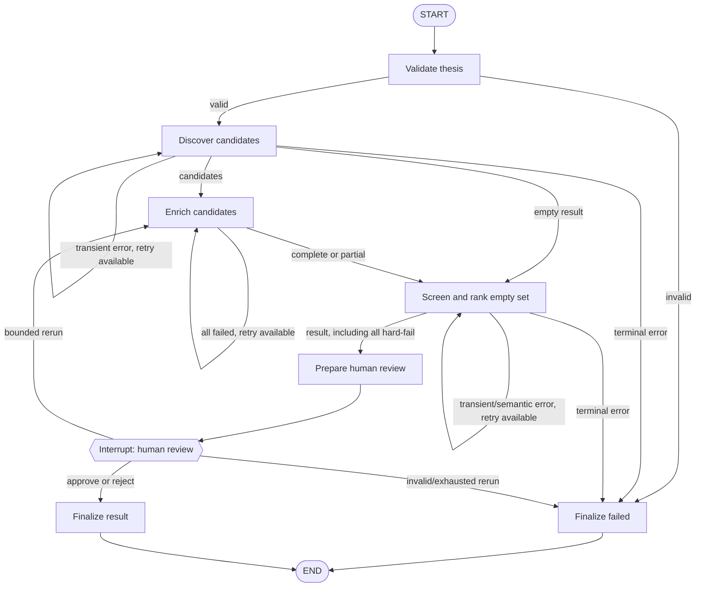

# LangGraph orchestration and human review

## Why LangGraph is used here

M1–M5 remain straightforward service code. Plain sequential Python is still sufficient to call
those services once, but it becomes awkward when execution must stop for a reviewer, retain all
state, resume in another call, rerun selected stages, and expose recoverable versus terminal
failures. LangGraph provides the state machine, conditional edges, checkpoint identity, and
interrupt/resume protocol for those concerns. It is not used as an LLM decision-maker and is
not a requirement for every agentic application.

## Graph



`screen_and_rank` deliberately invokes the existing combined M4/5 service. Splitting its
deterministic and semantic internals into artificial graph nodes would duplicate its contract
and blur ownership.

## Typed state

`WorkflowState` is a `TypedDict` whose values use the existing domain types:

- `AcquisitionThesis`, `CandidateDiscoveryResult`, candidates and `CandidateProfile` values;
- provisional `Shortlist` and terminal `WorkflowResult`;
- `HumanReviewDecision`;
- `WorkflowStatus`, structured warnings/errors, per-stage retry counters, and trace events.

Nodes return only the state fields they update. No node stores provider-native response models
or arbitrary scratch dictionaries.

## Node responsibilities

| Node | Responsibility |
| --- | --- |
| `validate_thesis` | Round-trip the structured thesis through its validated schema. |
| `discover_candidates` | Invoke the M2 discovery service and propagate candidates/provenance. |
| `enrich_candidates` | Invoke M3 once per candidate; retain partial successes and warnings. |
| `screen_and_rank` | Invoke the M4/5 service; preserve the full audit result. |
| `prepare_human_review` | Mark and checkpoint the inspectable pre-interrupt state. |
| `human_review` | Interrupt, validate the resume payload, and record approve/reject/rerun. |
| `finalize` | Build the terminal result and approved shortlist without deleting audit results. |

The graph depends on structural service protocols. Live or fixture implementations can be
composed without changing graph code.

## Routing, retries, and failures

Routes are deterministic. Default retry limits allow one retry for discovery, all-candidate
enrichment failure, and screening/semantic provider failure. Validation errors and malformed
business inputs are never retried. A `RetryPolicy` can reduce any limit to zero. Exhaustion
creates a non-recoverable `WorkflowIssue` and either finalizes failure or, when safe partial
results exist, proceeds to review with an explicit warning.

Partial enrichment is not retried as a whole: successful profiles proceed and failed candidates
remain visible through structured issues and warnings. Empty discovery and an all-hard-fail
screening result also proceed to review, because both require a human business decision rather
than an infrastructure retry.

## Human review and resume

`prepare_human_review` writes `AWAITING_HUMAN_REVIEW`; `human_review` then calls LangGraph's
`interrupt`. The caller uses the same `thread_id` and resumes with `Command(resume=...)` through
`WorkflowApplication.resume`.

The structured decision supports:

- `approve`: approve every ranked candidate, or retain a named subset;
- `reject`: return no approved shortlist while preserving screening results for audit;
- `rerun`: repeat enrichment and screening once by default, then pause again.

Candidate names or domains may identify approved/rejected entries. Unknown identifiers,
overlapping lists, malformed decisions, and excess reruns become explicit failures.

## Checkpointing and API assumptions

The default is LangGraph `InMemorySaver`, suitable for one trusted process, tests, and the M6
demo. Its local serializer preserves Project 2's immutable domain objects exactly and must never
load untrusted checkpoint bytes. Memory is lost on process restart. A durable deployment must
inject a secured checkpointer and define retention, tenancy, encryption, and serializer policy.

M6 targets `langgraph>=1.2.13,<1.3` and uses the current `StateGraph`, `interrupt(...,
response_schema=...)`, `Command(resume=...)`, and `thread_id` APIs. LangSmith tracing can be
enabled through its standard environment variables but is not required by code or tests.

## Observability

Every completed node appends a `WorkflowTraceEvent` with the node, resulting status, elapsed
milliseconds, timestamp, message, and retry count. Application logs record node entry/outcome
without emitting secrets or complete provider payloads. Warnings and structured issues survive
to the terminal result.

## Offline demo

From `02_target_screening_sourcing`:

```powershell
python -m ma_target_screening.demo_workflow
```

The demo loads the synthetic thesis and M2–M5 fixtures, reaches a genuine interrupt, prints the
review summary, resumes with approval, and prints the approved candidates and execution trace.
It requires no network, API key, or live LLM.

## Known limitations

- The bundled checkpointer is process-local and not suitable for multi-worker deployment.
- Human identity, authentication, authorization, and UI are intentionally absent.
- Reviewer edits are limited to candidate retention/rejection and one bounded full enrichment
  rerun; per-field corrections are not modeled.
- Retries do not add exponential backoff because fixture execution is synchronous and M6 does
  not select a live provider policy.
- The graph processes enrichment sequentially; concurrency and rate limits belong with future
  production provider composition.
