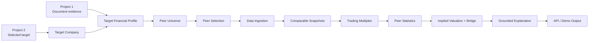

# Comparable Companies & Valuation Copilot

Comparable Companies & Valuation Copilot builds auditable public-market peer sets, normalizes
financial and market data, calculates trading multiples and valuation ranges deterministically,
and adds evidence-grounded explanations around peer quality and valuation drivers. It is an
educational portfolio project, not investment advice.

## Project status

Project 3 V1 is complete:

- M0 — Architecture + valuation workflow design: complete
- M1 — Target financial profile + normalized metrics: complete
- M2/3 — Comparable selection + market/financial ingestion: complete
- M4/5 — Trading multiples + valuation range + assisted reasoning: complete
- M6 — Evaluation + API/demo + V1 polish: complete

## Problem

Trading comps look simple only after the difficult choices have been hidden. A reviewable result
must preserve why peers were selected, which date and period every input represents, whether a
metric is reported or adjusted, why an observation was excluded, and how each valuation number
was derived. This project makes those choices explicit.

## Why trading comps matter

Public-company multiples provide market-based reference points for a selected target. They are
useful as a range, not a single true value: peer relevance, accounting basis, market timing,
capital structure, forecast availability, and small samples all affect interpretation.

## What the system does

The offline V1 runs this complete workflow:

1. validates a target financial profile;
2. builds and scores a comparable universe;
3. records inclusion, exclusion, review, and manual-override decisions;
4. ingests historical, forecast, market, and capital-structure facts through provider ports;
5. calculates equity value, enterprise value, and four focused trading multiples;
6. produces transparent peer statistics and outlier flags;
7. applies 25th-percentile, median, and 75th-percentile anchors to the target;
8. bridges implied enterprise value to equity and per-share value when inputs support it;
9. generates a structured, evidence-referenced explanation without changing the math; and
10. returns the result through a Python service, CLI demo, evaluation runner, or FastAPI API.

## Architecture



The core is provider-neutral. Domain objects and deterministic services do not depend on
FastAPI, a vendor SDK, or a live LLM. See [the architecture](docs/architecture.md) for ownership,
stage contracts, and integration boundaries.

## Target financial profile

`TargetFinancialProfile` preserves Decimal values, currency, scale, period, actual/estimate
status, reported/adjusted basis, source observations, normalization decisions, conflicts,
quality flags, and evidence. Units normalize to millions where appropriate; no FX conversion is
invented. Diluted end-of-period shares are distinct from weighted-average EPS shares.

## Comparable selection

Selection combines transparent deterministic criteria with a bounded semantic evaluator.
Every candidate keeps dimension-level results, confidence, rationale, and evidence. Required
deterministic failures control exclusion. Manual inclusion or exclusion records the analyst,
time, and rationale without erasing the original automated decision.

## Market and financial data

Narrow provider ports separate universe, financial, forecast, and market capabilities. Snapshot
ingestion preserves source and as-of dates, continues safely when one provider fails, and emits
typed issues for stale, missing, conflicting, negative, and date-incompatible inputs. The V1
ships deterministic providers only; it does not claim a licensed live feed.

## Trading multiples

The supported V1 methods are `EV / Revenue`, `EV / EBITDA`, `EV / EBIT`, and `P / E`.
Numerator and denominator families, currency, unit, period, estimate status, and accounting
basis are validated. A non-positive denominator is retained but marked not meaningful; missing
or incompatible input is unavailable. LTM and forecast labels are never inferred or mixed.

Equity value and enterprise value use explicit sourced inputs:

```text
Equity value = share price × diluted end-of-period shares
Enterprise value = equity value + debt + preferred stock + minority interest - cash
```

Debt and cash are required for V1 EV. Optional preferred stock and minority interest are used
only when sourced and otherwise disclosed as omitted.

## Peer statistics

For each exact method/period/basis partition, the engine reports count, minimum, 25th
percentile, median, 75th percentile, maximum, exclusions, warnings, and valid/excluded counts.
Percentiles use Decimal Hyndman–Fan type 7 interpolation. Tukey 1.5-IQR outliers are flagged
when at least four observations exist and are retained by default; no observation disappears
silently.

## Valuation range and EV/equity bridge

Low, mid, and high use the peer 25th percentile, median, and 75th percentile independently for
each method. EV methods multiply the compatible target metric to derive implied EV, then subtract
debt, preferred stock, and minority interest and add cash to derive implied equity value. P/E
uses compatible EPS for implied share price or net income for implied equity value. Diluted
end-of-period shares support per-share output. Methods are not automatically averaged.

## AI-assisted reasoning

The explanation provider receives immutable calculated output, selection rationale, exclusions,
warnings, and evidence references. It may assess peer quality, outliers, metric relevance,
sensitivities, and caveats. It cannot calculate, mutate, or replace authoritative numbers. The
default provider is deterministic and offline; live LLM quality is outside the V1 baseline.

## Evidence and provenance

Every final figure includes a calculation trace linking the target metric, peer observation,
statistic, bridge component, policy version, warnings, and evidence IDs. Serialization emits
Decimals as strings and dates/times explicitly so API JSON does not introduce binary-float
ambiguity.

## Evaluation

The curated public-safe dataset contains eight cases: profitable software, negative EBITDA,
levered industrial, mixed reported/adjusted EBITDA, stale/missing market data, incomplete capital
structure, available forward estimates, and negative earnings. The runner reports seven
subsystems separately; it never collapses them into a misleading aggregate score.

The checked-in baseline passes 33/33 deterministic checks:

| Subsystem | Checks | Result |
| --- | ---: | --- |
| Target financial profile | 6 | PASS |
| Comparable selection | 5 | PASS |
| Market/financial ingestion | 5 | PASS |
| Trading multiples | 6 | PASS |
| Peer statistics | 2 | PASS |
| Implied valuation | 4 | PASS |
| AI explanation | 5 | PASS |

This is a regression benchmark over controlled fixtures, not production-grade or market-wide
validation. See [evaluation methodology](docs/evaluation.md) and the checked-in
[baseline report](evaluation/baselines/m06_offline_report.md).

## API

The minimal FastAPI surface is:

- `GET /health`
- `POST /target/profile`
- `POST /valuation/run`
- `GET /valuation/{valuation_id}`

`POST /valuation/run` executes the complete offline workflow and returns the peer universe,
selection decisions, snapshots, multiples, statistics, valuation ranges, bridges, traces,
warnings, and explanation. Results are stored in process memory for retrieval; restarting the
server clears them. See [API usage and error behavior](docs/api.md).

## Demo

The default demo is credential-free and reproducible. Its five fixture peers include normal,
high-multiple, negative-profitability, missing-data, stale-data, and forecast scenarios.

```powershell
python -m ma_comparable_valuation.demo_valuation
```

The JSON output identifies each completed stage and retains excluded or unavailable observations.

## Setup

Python 3.11 or later is required.

```powershell
cd 03_comparable_companies_valuation
python -m venv .venv
.\.venv\Scripts\python.exe -m pip install -e ".[dev]"
```

No API key or network call is needed. V1 exposes only `offline_fixture` provider mode. The
provider interfaces can accept a separately implemented live adapter, but no paid or unstable
scraping integration is bundled.

## Testing

```powershell
.\.venv\Scripts\python.exe -m ruff check src tests
.\.venv\Scripts\python.exe -m ruff format --check src tests
.\.venv\Scripts\python.exe -m mypy
.\.venv\Scripts\python.exe -m pytest
.\.venv\Scripts\python.exe -m ma_comparable_valuation.evaluation_cli
```

To run the API:

```powershell
.\.venv\Scripts\macv-api.exe
```

Interactive OpenAPI documentation is available at `http://127.0.0.1:8003/docs`.

## Limitations

- Fixture-heavy evaluation is deliberately small and cannot establish real-market accuracy.
- No Bloomberg, Capital IQ, licensed market feed, or live consensus-estimate provider is bundled.
- Forward estimates exist only where the supplied provider provides them.
- There is no FX conversion, broad calendarization, or sector-specific multiple library.
- V1 excludes financial-institution-specific methods, DCF, precedent transactions, merger
  models, accretion/dilution, and LBO analysis.
- The offline explanation fixture validates grounding constraints, not open-ended LLM prose.
- The API has no production authentication, durable result store, rate limiting, UI, or banker
  formatting/export.

## Relationship to Projects 1 and 2

Project 1 can provide source-backed company and financial evidence through structural adapters;
Project 3 still validates valuation-specific completeness. Project 2 can provide a screened
candidate and identity/profile data; Project 3 owns peer research and valuation. Neither upstream
project is a runtime dependency, and the repository does not claim an automated cross-project
deployment.

## Future project connection

Project 4 may reuse concepts such as target identity, evidence references, normalized financial
metrics, valuation metric semantics, and range structures. No precedent-transactions workflow is
implemented or designed here.

See [the portfolio and interview guide](docs/portfolio-interview-guide.md) for an accurate project
summary, resume bullets, interview narrative, reusable components, and concepts to know.
