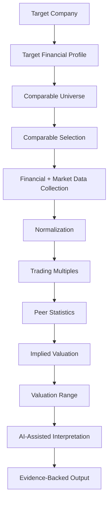
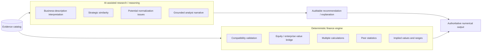
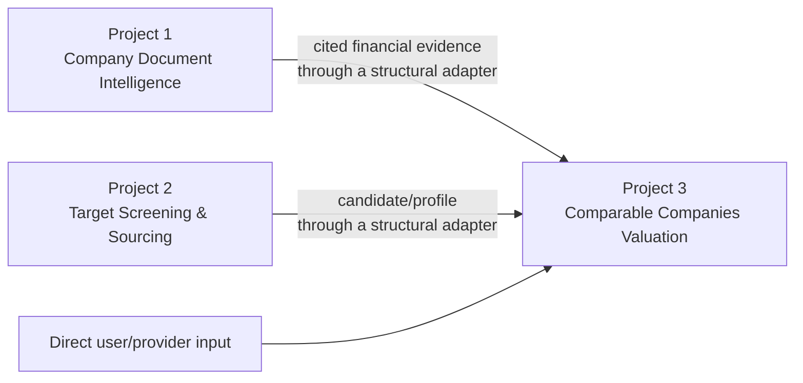

# Comparable Companies & Valuation Copilot

Project 3 is the valuation layer of the AI × M&A portfolio. Its intended question is:

> What is this company worth relative to relevant publicly traded comparable companies, and
> why?

The primary method is **Comparable Companies Analysis (trading comps)**. Public-company
enterprise-value and equity-value multiples will eventually be applied to compatible target
metrics to produce an evidence-backed valuation range. This is educational analytical software,
not investment advice.

## Milestone status

- **M0 — Architecture + valuation workflow design: ✅ complete**
- **M1 — Target financial profile + normalized metrics: ✅ complete**
- **M2/3 — Comparable selection + market/financial ingestion: ✅ complete**
- M4/5 — Trading multiples + valuation range + AI-assisted reasoning: **NOT IMPLEMENTED**
- M6 — Evaluation + API/demo + V1 polish: **NOT IMPLEMENTED**

M0 supplies architecture and provider-neutral domain contracts. M1 adds the target financial
profile. M2/3 adds an auditable peer universe, deterministic and pluggable semantic criteria,
manual overrides, identity deduplication, market/financial/forecast provider ports, partial-safe
snapshot ingestion, Project 1 and Project 2 adapters, and an offline five-peer demo. The project
still does **not** calculate enterprise value, trading multiples, statistics, or valuation.

## What comparable companies analysis is

Trading comps compare a target with relevant listed businesses using consistently defined
market and financial measures. Typical future multiples are `EV / Revenue`, `EV / EBITDA`,
`EV / EBIT`, and `P / E`. Peer statistics such as the 25th percentile, median, and 75th
percentile become valuation anchors; the target metric and capital structure then translate
those anchors into implied enterprise value, equity value, and—where applicable—per-share value.

The method is a range, not a single magically precise answer. Peer selection, periods,
accounting adjustments, capital structure, market timing, and outliers all affect the result.

## Planned workflow



The complete stage contracts, responsibilities, provenance needs, and failure modes are in
[docs/architecture.md](docs/architecture.md). The finance conventions are in
[docs/valuation_methodology.md](docs/valuation_methodology.md), and the implemented M1 layer is
documented in [docs/target-financial-profile.md](docs/target-financial-profile.md).

## Deterministic finance, assisted reasoning



An LLM may later interpret descriptions, explain inclusion or exclusion, surface possible
adjustments, and narrate deterministic results. It may not invent inputs, perform authoritative
arithmetic, override formulas, or supply an untraceable valuation.

## Project relationships



Project 1 can support filing ingestion, retrieval, extraction, and citations through a structural
peer-financial adapter, but it does not guarantee every valuation metric Project 3 requires.
Project 2 candidates and profiles can be mapped through a structural identity/profile adapter.
Project 3 remains independently usable and imports no Project 1 or Project 2 implementation type.

## Scope boundary

Project 3 is designed for public trading comps. It is not a DCF, precedent-transactions,
accretion/dilution, LBO, purchase-price-allocation, merger-model, or due-diligence system.
Those methods are not hidden inside the roadmap.

## Development

```powershell
cd 03_comparable_companies_valuation
python -m pip install -e ".[dev]"
python -m ruff check .
python -m ruff format --check .
python -m mypy
python -m pytest
python -m ma_comparable_valuation.demo_profile
python -m ma_comparable_valuation.demo_peers
```

No API keys or network access are required. The project has no runtime dependencies outside the
Python standard library.

## Limitations

- No live market-data provider is bundled: unstable unauthenticated sources were deliberately not
  made a production dependency. Provider interfaces and deterministic fixtures are implemented.
- No FX conversion, enterprise-value calculator, multiple calculator, statistics engine,
  valuation range, narrative generator, API, UI, or deployment.
- Contracts prevent silent loss of key semantics; they do not prove that source data is correct.
- Calendarization, FX conversion, capital-structure policy, and accounting adjustments are
  designed but deliberately deferred.
- The initial enums cover the planned V1 methods and can be extended through reviewed schema
  changes rather than untyped strings.
- `COMPLETE_ENOUGH_FOR_VALUATION` means the configured M2/3 input fields are present and pass
  snapshot quality gates; it does not assert correctness or calculate a valuation.

See [docs/comparable-selection-data.md](docs/comparable-selection-data.md) for the implemented
selection formula, override semantics, providers, consistency checks, and failure behavior.
