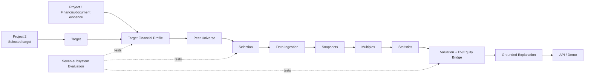
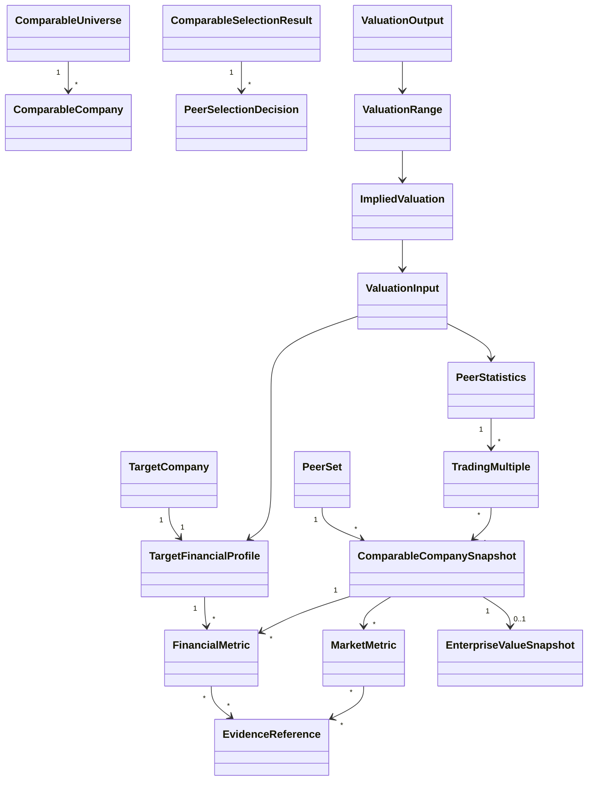

# Project 3 architecture

## Ownership boundary

Project 3 owns the provider-neutral path from a selected company to an auditable public trading
comps valuation. It owns valuation-specific period and money semantics, peer selection records,
market snapshots, normalization policy, multiple definitions, deterministic statistics and
valuation calculations, and grounded explanation of those results.

It does not own document parsing/retrieval (Project 1), target sourcing (Project 2), external
vendor systems, or other valuation methods. M0 defined the boundaries, M1 implemented the target
profile, M2/3 implemented peer selection and data ingestion, M4/5 activated deterministic
trading-comps calculations plus a constrained explanation boundary, and M6 adds evaluation and a
thin API/demo delivery layer.

## Final V1 flow



## Stage contracts

| Stage | Input | Output | Responsibility | Provenance requirement | Main failure modes |
| --- | --- | --- | --- | --- | --- |
| Target company | User selection, Project 2 candidate, or provider identifier | `TargetCompany` | Deterministic identity validation; optional assisted entity research | Origin and identifiers | Ambiguous entity, wrong listing, stale identity |
| Target financial profile | Target identity and cited source facts | `TargetFinancialProfile` | Deterministic schema/compatibility; assisted extraction may propose facts | Evidence per metric; period, basis, currency, unit | Missing metric, conflicting disclosures, extraction error |
| Comparable universe | Target profile and universe request | `ComparableUniverse` | Provider retrieval plus deterministic identity normalization | Source and observation time for each candidate | Incomplete coverage, survivorship bias, duplicates |
| Comparable selection | Universe and explicit selection policy | `ComparableSelectionResult` / `PeerSet` | Deterministic scale/geography checks; assisted business-model interpretation | Inclusion/exclusion rationale, evidence, confidence | Unsupported rationale, circular selection, cherry-picking |
| Data collection | Selected peers, requested metrics, valuation date | `ComparableCompanySnapshot` values | Providers acquire data; core validates requested fields | Evidence on every financial and market input | Missing/stale data, conflicting providers, timestamp mismatch |
| Normalization | Raw metrics and normalization policy | Compatible normalized metrics plus adjustment records | Deterministic transformations; AI may flag issues for review | Raw value, adjustment, policy, approver, evidence | Silent reported/adjusted mix, period mismatch, double adjustment |
| Trading multiples | Compatible EV/equity numerator and denominator | `TradingMultiple` | Deterministic only | Input IDs, formula/policy version, exclusion state | Wrong numerator family, zero/negative denominator, unit mismatch |
| Peer statistics | Auditable multiple observations | `PeerStatistics` | Deterministic only | Included/excluded observations and treatment reasons | Too few peers, outlier distortion, silent filtering |
| Implied valuation | Target metric, selected statistic, capital structure | `ImpliedValuation` | Deterministic only | Metric ID, statistic, bridge inputs, calculation policy | Incompatible period/basis, incomplete equity bridge |
| Valuation range | Multiple anchors and target inputs | `ValuationRange` | Deterministic only | Low/mid/high lineage and consistent basis | False precision, mixed methods or dates |
| Interpretation | Deterministic outputs and bounded evidence | Grounded commentary | AI-assisted, schema-constrained, non-authoritative | Cite facts, decisions, and calculation IDs | Hallucination, unsupported causal claims, arithmetic rewrite |
| Evidence-backed output | Models, calculations, decisions, narrative | `ValuationOutput` | Deterministic assembly | End-to-end lineage | Missing citations, inconsistent schema/version |

## Logical package boundaries

M0 implemented `domain` and `ports`; M1 added the target-profile path; M2/3 adds selection and
ingestion behavior:

```text
ma_comparable_valuation/
    domain.py             # immutable value objects
    normalization.py      # exact name and same-currency unit policy
    profile_service.py    # validate, normalize, merge, conflict, completeness
    serialization.py      # versioned complete-profile JSON
    project1_adapter.py   # structural Project 1 public-output adapter
    fixtures.py           # credential-free fixture provider
    demo_profile.py       # offline M1 demonstration
    selection.py          # criteria, semantic advisory boundary, manual overrides
    identity.py           # listing-aware peer deduplication
    ingestion.py          # partial-safe snapshot construction and quality checks
    peer_fixtures.py      # offline universe, financial, market, forecast fixtures
    project1_peer_adapter.py # Project 1 research-to-peer-financial boundary
    project2_adapter.py   # Project 2 candidate/profile identity boundary
    demo_peers.py         # offline M2/3 selection-to-snapshot demonstration
    valuation.py          # deterministic values, multiples, statistics, ranges, explanation port
    valuation_fixtures.py # five-peer offline M4/5 scenarios
    workflow.py           # complete offline M1-M6 composition
    presentation.py       # Decimal-safe, evidence-complete response projection
    evaluation/           # curated dataset, independent subsystem checks, reports
    api/                  # strict request/response schemas and minimal FastAPI surface
    demo_valuation.py     # complete offline V1 demonstration
    api_cli.py            # local API entry point
    evaluation_cli.py     # reproducible baseline generation
    ports.py              # provider contracts
```

Implemented services include `TargetFinancialProfileService`, `ComparableSelectionService`,
`ComparableSnapshotService`, `ValuationEngine`, and `OfflineValuationService`. The valuation
engine owns value, multiple, statistics, bridge, and range calculations; the workflow service
only composes existing stages. FastAPI remains a delivery adapter rather than a second domain
model.

## Domain relationships



M2/3 activates peer selection and snapshot contracts. `ComparableSelectionResult` retains every
candidate disposition and criterion result; `PeerSet` retains all decisions plus snapshots for
included companies. Snapshot flags preserve missing, stale, conflicting, negative, and
date-inconsistent inputs. M4/5 consumes these objects through `ValuationEngine`; it never
rewrites the M1–M3 source observations.

## Deterministic and AI boundary

Deterministic code is the only authority for validation, unit/currency/period compatibility,
equity and enterprise value formulas, trading multiples, exclusions, percentiles, implied
values, equity bridges, per-share values, and range assembly. Inputs and policy versions must
be explicit.

AI-assisted components may interpret business descriptions, compare business models, search
documents, propose (not apply) normalization issues, explain peer decisions and outliers, and
write an analyst-style narrative grounded in supplied calculations and evidence. Generated
output must use structured references and cannot mutate authoritative numerical objects.

LangGraph is absent. Ordinary services are sufficient until real routing, retry, durable state,
human review, or tool orchestration requirements are demonstrated.

## Comparable-selection design

The selection policy can consider industry, sub-industry, products/services, geography,
customer type, revenue mix, growth, profitability, scale, margins, capital intensity, and
business model. Dimensions are classified before evaluation:

- deterministic: exact classifications, geography, revenue scale, growth, margins, and other
  comparable normalized numbers;
- semantic/strategic: business-model, product, customer, and revenue-mix similarity when exact
  classifications are insufficient.

`PeerSelectionDecision` records an include, exclude, or review decision; dimension-level
observations; rationale; supporting evidence; confidence; and policy version. The universe,
selected peers, and rejected peers remain linked so “why X, not Y?” is answerable. An assisted
recommendation never overrides a deterministic incompatibility or substitutes for missing data.

## Provider architecture

Narrow protocols are defined for company profiles, financial data, market data, comparable
universes, and forecasts. Fixture implementations cover universe, historical financial, market,
and forecast capabilities. Vendor-native types do not cross the boundary, and provider failures
become typed partial-data issues.

The contracts are intentionally capability-specific: a source can supply market snapshots
without pretending to supply audited financials or forecasts. No live provider is selected in
M2/3 because no reliable, licensed, keyless source meets the complete contract.

## Project integrations

Project 1's public research shape feeds `Project1PeerFinancialDataProvider`, which maps document
metrics into Project 3 decimals, periods, bases, units, and evidence. Project 3 does not assume
Project 1 extracts diluted shares, market prices, net debt, consensus forecasts, or every
adjustment.

Project 2 candidates and enriched profiles can pass through `Project2CandidateAdapter`. Project 3
then owns valuation research and peer analysis. Direct construction remains supported, so
neither upstream project is a runtime prerequisite.

## Fixture-first and offline design

Implemented fixture providers use TargetCo and PeerA–PeerE with controlled periods, currencies,
reported bases, as-of times, missing debt, negative profitability, stale pricing, forecasts, and
provider-failure switches. They contain no expected multiple or valuation output.

Unit tests and the default demo must not call Yahoo Finance, Alpha Vantage, Bloomberg, Capital
IQ, or any live source. Live-provider contract tests, if added, are isolated, opt-in, and never
the CI correctness baseline.
