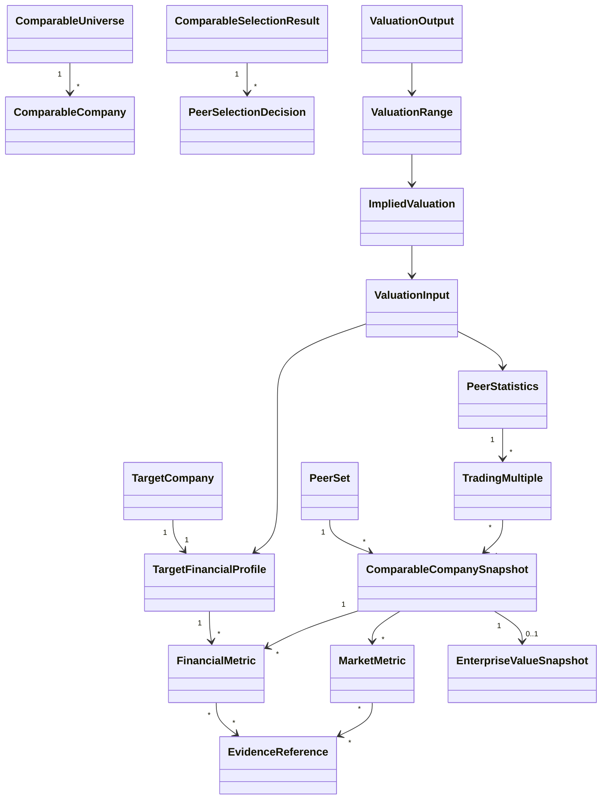

# Project 3 architecture

## Ownership boundary

Project 3 owns the provider-neutral path from a selected company to an auditable public trading
comps valuation. It owns valuation-specific period and money semantics, peer selection records,
market snapshots, normalization policy, multiple definitions, deterministic statistics and
valuation calculations, and grounded explanation of those results.

It does not own document parsing/retrieval (Project 1), target sourcing (Project 2), external
vendor systems, or other valuation methods. M0 defines boundaries only; later milestones must
implement them without weakening the contracts.

## Stage contracts

| Stage | Input | Output | Responsibility | Provenance requirement | Main failure modes |
| --- | --- | --- | --- | --- | --- |
| Target company | User selection, Project 2 candidate, or provider identifier | `TargetCompany` | Deterministic identity validation; optional assisted entity research | Origin and identifiers | Ambiguous entity, wrong listing, stale identity |
| Target financial profile | Target identity and cited source facts | `TargetFinancialProfile` | Deterministic schema/compatibility; assisted extraction may propose facts | Evidence per metric; period, basis, currency, unit | Missing metric, conflicting disclosures, extraction error |
| Comparable universe | Target profile and universe request | `ComparableUniverse` | Provider retrieval plus deterministic identity normalization | Source and observation time for each candidate | Incomplete coverage, survivorship bias, duplicates |
| Comparable selection | Universe and explicit selection policy | `ComparableSelectionResult` / `PeerSet` | Deterministic scale/geography checks; assisted business-model interpretation | Inclusion/exclusion rationale, evidence, confidence | Unsupported rationale, circular selection, cherry-picking |
| Data collection | Selected peers, requested metrics, valuation date | `ComparableCompanySnapshot` values | Providers acquire data; core validates requested fields | Evidence on every financial and market input | Missing/stale data, conflicting providers, timestamp mismatch |
| Normalization | Raw metrics and normalization policy | Compatible normalized metrics plus adjustment records | Deterministic transformations; AI may flag issues for review | Raw value, adjustment, policy, approver, evidence | Silent reported/adjusted mix, period mismatch, double adjustment |
| Trading multiples | Compatible EV/equity numerator and denominator | `TradingMultiple` | Deterministic only | Input IDs, formula/policy version, exclusion state | Wrong numerator family, zero/negative denominator, unit mismatch |
| Peer statistics | Auditable multiple observations | `PeerStatistics` | Deterministic only | Included/excluded observations and treatment reasons | Too few peers, outlier distortion, silent filtering |
| Implied valuation | Target metric, selected statistic, capital structure | `ImpliedValuation` | Deterministic only | Metric ID, statistic, bridge inputs, calculation policy | Incompatible period/basis, incomplete equity bridge |
| Valuation range | Multiple anchors and target inputs | `ValuationRange` | Deterministic only | Low/mid/high lineage and consistent basis | False precision, mixed methods or dates |
| Interpretation | Deterministic outputs and bounded evidence | Grounded commentary | AI-assisted, schema-constrained, non-authoritative | Cite facts, decisions, and calculation IDs | Hallucination, unsupported causal claims, arithmetic rewrite |
| Evidence-backed output | Models, calculations, decisions, narrative | `ValuationOutput` | Deterministic assembly | End-to-end lineage | Missing citations, inconsistent schema/version |

## Logical package boundaries

M0 implements only `domain` and `ports`:

```text
ma_comparable_valuation/
    domain.py       # immutable value objects and explicit serialization
    ports.py        # future provider contracts
```

Likely later service boundaries are `TargetProfileService`, `ComparableSelectionService`,
`FinancialNormalizationService`, `MultipleCalculationService`, `PeerStatisticsService`,
`ValuationService`, and `ValuationExplanationService`. They should be introduced only with
their milestone's behavior; M0 does not create empty service classes.

## Domain relationships



The implemented foundational contracts cover identity, evidence, periods, financial and market
metrics, capital structure, snapshots, selection decisions, multiple definitions, and derived
calculation lineage. Aggregate valuation result contracts remain documented until their engine
is implemented to avoid freezing speculative shapes.

## Deterministic and AI boundary

Deterministic code is the only authority for validation, unit/currency/period compatibility,
equity and enterprise value formulas, trading multiples, exclusions, percentiles, implied
values, equity bridges, per-share values, and range assembly. Inputs and policy versions must
be explicit.

AI-assisted components may interpret business descriptions, compare business models, search
documents, propose (not apply) normalization issues, explain peer decisions and outliers, and
write an analyst-style narrative grounded in supplied calculations and evidence. Generated
output must use structured references and cannot mutate authoritative numerical objects.

LangGraph is absent. Ordinary services are sufficient until real routing, retry, durable state,
human review, or tool orchestration requirements are demonstrated.

## Comparable-selection design

The selection policy can consider industry, sub-industry, products/services, geography,
customer type, revenue mix, growth, profitability, scale, margins, capital intensity, and
business model. Dimensions are classified before evaluation:

- deterministic: exact classifications, geography, revenue scale, growth, margins, and other
  comparable normalized numbers;
- semantic/strategic: business-model, product, customer, and revenue-mix similarity when exact
  classifications are insufficient.

`PeerSelectionDecision` records an include, exclude, or review decision; dimension-level
observations; rationale; supporting evidence; confidence; and policy version. The universe,
selected peers, and rejected peers remain linked so “why X, not Y?” is answerable. An assisted
recommendation never overrides a deterministic incompatibility or substitutes for missing data.

## Provider architecture

Future narrow protocols are defined for company profiles, financial data, market data,
comparable universes, and forecasts. Adapters translate filings, user uploads, structured
fixtures, public APIs, or commercial databases into domain models. Vendor-native types do not
cross the boundary, and provider errors will later map into stable Project 3 exception families.

The contracts are intentionally capability-specific: a source can supply market snapshots
without pretending to supply audited financials or forecasts. No provider is selected in M0.

## Project integrations

Project 1's public application/service output can later feed a Project 3 adapter with document
facts and citations. Its ingestion, retrieval, structured research, and provenance patterns are
reusable capabilities; a valuation-specific adapter is still required to map string-valued
research metrics into Project 3 decimals, periods, bases, units, and evidence. Project 3 does
not assume Project 1 extracts diluted shares, net debt, consensus forecasts, or every adjustment.

Project 2 can later pass a selected `CandidateCompany` or shortlist item through an identity
adapter. Project 3 then owns valuation research and peer analysis. Direct target construction
remains supported, so neither Project 2 nor its workflow is a runtime prerequisite.

## Fixture-first and offline design

A later `FixtureFinancialDataProvider`, `FixtureMarketDataProvider`, and
`FixtureComparableUniverseProvider` should use a versioned dataset such as TargetCo and
PeerA–PeerD. Fixtures will include controlled periods, currencies, reported/adjusted bases,
as-of times, missing values, negative earnings, and an extreme multiple. Expected calculations
will be hand-reviewed and stored separately from runtime code.

Unit tests and the default demo must not call Yahoo Finance, Alpha Vantage, Bloomberg, Capital
IQ, or any live source. Live-provider contract tests, if added, are isolated, opt-in, and never
the CI correctness baseline.
