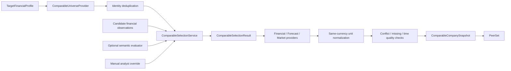

# Comparable selection and peer-data pipeline

## Implemented boundary

M2/3 turns a `TargetFinancialProfile` into an auditable `ComparableSelectionResult`, then builds
`ComparableCompanySnapshot` objects for included peers. It does not calculate market
capitalization, enterprise value, trading multiples, percentiles, or implied valuation. Supplied
market capitalization is retained as a sourced observation, never recomputed in this milestone.



## Universe and identity

`ComparableUniverse` preserves the target, provider, observation time, candidates, evidence, and
warnings. A listing key prefers `(exchange, ticker)`, then an explicit identifier, then
`(country, normalized name)`. Duplicate aliases are merged while evidence and a warning are
retained. This is deterministic resolution, not probabilistic entity matching.

`ComparableCompany` carries only selection-relevant information: listing identity, industry,
sub-industry, description, products/services, customer type, geographies, business model,
fiscal year end, reporting currency, website domain, and evidence.

## Selection policy

The default `peer-selection-v1` policy is intentionally simple:

| Criterion | Method | Weight | Required | Rule |
| --- | --- | ---: | --- | --- |
| Industry | Deterministic | 25% | Yes | Exact case-insensitive match |
| Sub-industry | Deterministic | 15% | No | Exact case-insensitive match |
| Country | Deterministic | 10% | No | Exact case-insensitive match |
| Revenue scale | Deterministic | 20% | No | Peer/target actual revenue is 0.25x–4.0x |
| Business model | Semantic/advisory | 20% | No | Pluggable structured evaluation |
| Customer type | Semantic/advisory | 10% | No | Pluggable structured evaluation |

The weighted score is `sum(weight × criterion score) / assessed weight`; missing criteria are
not treated as zero. `confidence` is assessed-weight coverage, not a model probability. Include
is at least 0.65, review is at least 0.45, and lower scores exclude. A required deterministic
failure excludes regardless of score; a missing required criterion gives `INSUFFICIENT_DATA`.
The fixture semantic evaluator is a deterministic test double, not AI.

Each decision retains criterion results, methods, scores, evidence, missing information,
rationale, policy ID, warnings, and any manual override. A force include/exclude record keeps the
analyst, timestamp, rationale, evidence, and the unmodified underlying evaluation.

## Provider and normalization policy

Narrow ports separate universe, financial, forecast, and market capabilities. Providers return
Project 3 domain objects, so provider-native payloads do not leak into the core. Financial and
capital values normalize to millions within the same currency using the M1 conversion table;
per-share observations remain per share. No FX conversion occurs.

Financial observations retain metric name, value, currency, unit, period, actual/estimate
status, reported/adjusted basis, evidence, and source IDs. Forecast providers may return only
estimate periods. Market observations retain kind, value, currency where applicable, share
basis, precise timezone-aware as-of time, evidence, and source IDs.

## Snapshot quality and failure handling

The snapshot service isolates provider calls for each included peer. A provider exception becomes
a `PROVIDER_FAILURE` issue; usable observations from other providers remain. Missing data stays
missing—debt, cash, EBITDA, forecasts, and price are never filled with zero.

The service:

- excludes observations that post-date the valuation time;
- flags price/market-cap observations older than the configured market tolerance;
- flags market versus capital-structure dates outside the configured alignment tolerance;
- preserves conflicting same-semantics observations and marks each as conflicting;
- retains FY, LTM, NTM, actual, and estimate observations separately;
- preserves negative EBITDA, EBIT, and EPS and marks them for later multiple treatment;
- marks a snapshot `COMPLETE_ENOUGH_FOR_VALUATION` only when revenue, EBITDA, share price, cash,
  debt, and end-of-period diluted shares are present without blocking quality flags.

This completeness flag is a field-presence gate, not an assertion that the data is economically
correct or that a valuation exists.

## Project integrations

`Project1PeerFinancialDataProvider` consumes Project 1's public structured research shape through
protocols and maps cited document metrics through the existing M1 normalization path. It cannot
supply market prices and does not guarantee diluted shares, forecasts, or all valuation fields.

`Project2CandidateAdapter` consumes structurally compatible public candidate/profile outputs and
maps identity, discovery evidence, industry tags, descriptions, and supported enriched facts.
Project 3 does not import Project 2 runtime modules and remains independently usable.

## Offline and live providers

The default demo uses synthetic TargetCo and PeerA–PeerE data. It covers included, excluded,
review, insufficient-data, override, stale-price, missing-debt, negative-profitability, actual,
forecast, and provider-failure paths without network access or keys.

No live provider ships in M2/3. A stable, licensed, time-consistent, keyless source was not
available for the full market, capital-structure, financial, and forecast contract. A future
adapter can implement the existing ports; live calls must remain outside deterministic CI.

## Demo

```powershell
python -m ma_comparable_valuation.demo_peers
```

The JSON output contains the initial universe, decisions and reasons, normalized snapshot data,
evidence IDs, quality flags, and warnings. It explicitly contains no valuation calculations.
