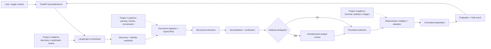
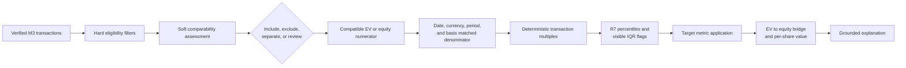
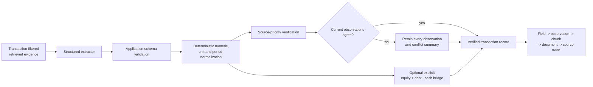
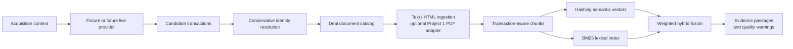

# Precedent Transactions Agent

Project 4 answers a specific M&A question:

> What have acquirers historically paid for businesses comparable to our target, and what does
> that imply for the target's valuation?

Project 4 V1 is an evidence-grounded research and valuation agent. It discovers historical deals,
retrieves transaction documents, extracts and verifies deal facts, normalizes point-in-time
financials, selects comparable acquisitions, calculates transaction multiples deterministically,
and produces an auditable analyst explanation. LangGraph coordinates the existing services with
bounded retries, checkpointed human review, structured failures, evaluation, and a FastAPI layer.

All six milestones are implemented. The default mode is fully offline and reproducible; no API
key, paid transaction database, live model, or network request is required.

## Roadmap

| Milestone | Scope | Status |
| --- | --- | --- |
| M0 | Architecture and transaction data models | Complete |
| M1/2 | Historical deal discovery and document intelligence/RAG | Complete |
| M3 | Structured extraction, financial normalization, verification | Complete |
| M4/5 | Comparable selection, transaction multiples, implied valuation | Complete |
| M6/7 | LangGraph, human review, evaluation, API/demo, V1 | Complete |

## End-to-end architecture



LangGraph coordinates service boundaries and never owns extraction or valuation logic. Detailed
nodes, transitions, retry limits, checkpointing, review, and failures are in
[`docs/architecture.md`](docs/architecture.md).

## Implemented package

`src/ma_precedent_transactions/` contains:

- `domain.py`: immutable transaction, party, lifecycle, value, ownership, financial, selection,
  and multiple contracts;
- `serialization.py`: schema-versioned JSON-safe round trips that preserve `Decimal`, dates,
  timestamps, enums, tuples, and evidence;
- `workflow/`: typed LangGraph state, thin nodes, bounded retries, in-memory checkpoints, review,
  offline composition, and start/resume facade;
- `fixtures.py`: six fictitious offline transaction cases;
- `config.py`: conservative M0 defaults that disable automatic FX and partial-stake gross-up;
- `errors.py`: package, validation, and serialization error types.
- `discovery/`: provider contracts, fixture discovery, filtering, and conservative identity
  resolution;
- `documents/`: source catalogs, text/HTML ingestion, optional Project 1 PDF adaptation, and
  transaction-aware chunking;
- `retrieval/`: deterministic semantic embeddings, BM25, in-memory indexing, filters, hybrid
  ranking, evidence results, and quality warnings;
- `pipeline.py`: independently testable discovery-to-index composition;
- `evaluation.py` and `demo.py`: a six-query benchmark and reproducible offline demonstration.
- `extraction/`: structured observation schemas, evidence-only prompts, fixture and optional
  LangChain providers, normalization, verification, extraction context retrieval, service, and
  field-level evaluation;
- `demo_m3.py`: seven-case offline retrieval-to-verification demonstration.
- `precedent/`: eligibility and comparability, deterministic transaction multiples, statistics,
  valuation ranges, bridge traces, and optional structured AI explanation;
- `demo_m45.py`: offline selection-to-valuation demonstration over seven synthetic deals.
- `evaluation_final.py` and `demo_final.py`: final subsystem evaluation and checkpointed V1 demo;
- `api/` and `api_cli.py`: typed FastAPI run, status, and human-review transport.

## LangChain versus LangGraph

LangChain is an optional adapter at two model boundaries: evidence-bounded structured extraction
and structured grounded explanation. Domain validation, normalization, verification, selection,
statistics, and valuation remain ordinary Python.

LangGraph owns state transitions, conditional routing, bounded retries, the analyst interrupt,
in-memory checkpoint resume, operational trace events, and finalization. Nodes call existing
services; they do not duplicate service business logic. The V1 retry policy applies only to
recoverable research and extraction/provider failures. Deterministic validation and finance errors
route to exclusion, review, or a structured terminal failure.

## Human-in-the-loop

`WHEN_NEEDED` review pauses only for material conflicts, ambiguous valuation bases, or minority and
partial-stake concerns. `ALWAYS` is useful for demonstrations, while `NEVER` records warnings and
continues under deterministic policy. An analyst can approve or reject the run, select an
observation from a known conflict, and force include or exclude a precedent with a rationale.
Reviewer identity, timestamp, resolutions, and overrides remain in the final audit record.

The default `InMemorySaver` supports resume within one trusted process. Its custom pickle serializer
is explicitly limited to same-process data written by the application; it is not a durable or
shared persistence design.

## Failure states and observability

Structured failure codes cover invalid input, no deals, insufficient retrieval, failed extraction,
blocked verification, required review, no eligible precedents, unavailable valuation, explanation
failure, and analyst rejection. Operational trace events record node, status, duration, retry count,
timestamp, and a short decision message. Logs omit document bodies, secrets, and model reasoning.

## M4/5 precedent selection and valuation



`ComparableTransactionSelector` treats status, announcement window, transaction type, ownership,
usable valuation basis, and revenue size as deterministic criteria. Business/product similarity,
geography, and buyer type are separately recorded judgments. The offline provider uses transparent
token overlap; a future model can implement the same narrow protocol. Each decision records its
criteria, rationale, evidence, missing information, inherited M3 warnings, and any analyst override.
An override requires an actor, timezone-aware timestamp, and rationale.

Completed control acquisitions form the default set. Withdrawn deals and transactions without a
usable EV or equity value are excluded. Minority investments are excluded by default, but policy
can retain them as a separate set or treat them as lower-comparability candidates. The engine never
grosses up a partial stake automatically. Strategic and financial buyers remain visible as a
comparability dimension; no universal pricing premium is assumed.

`TransactionMultipleEngine` supports transaction EV/revenue, EV/EBITDA, EV/EBIT, and equity
value/net income. It accepts only explicitly disclosed or independently calculated EV/equity
observations. An ambiguous headline value is never relabeled as EV. Denominators retain their exact
period and reported/adjusted basis. Post-announcement, stale, cross-currency, zero, and negative
denominators are excluded or marked not meaningful with a reason. Same-currency units are converted
to millions with `Decimal`; there is no automatic FX conversion.

Multiple sets are separated by multiple type, currency, period kind, and reported/adjusted basis.
Statistics use linear-interpolation R7 minimum, 25th percentile, median, 75th percentile, maximum,
and mean. The raw observation remains present when the documented 1.5×IQR rule flags an outlier;
exclusion requires an explicit policy. Warnings identify zero, one, or fewer than four valid deals
and mixed exact periods. A median is a sample statistic, not a claim of intrinsic value.

Implied ranges use P25/median/P75 independently for each method. Every case records the target
metric, selected statistic, formula, inputs, source evidence, and output. EV-based ranges bridge to
equity only when compatible target debt and cash exist; preferred stock and noncontrolling interest
are deducted when supplied. Per-share value requires a compatible diluted end-of-period share
count, avoiding weighted-average shares. Methods remain separate and are never averaged.

`LangChainValuationExplanationProvider` accepts an injected model using native structured output.
It receives only structured selection, deterministic statistics, ranges, warnings, and evidence
IDs. Unknown citations invalidate the explanation, while provider failure leaves all deterministic
results intact. `FixtureValuationExplanationProvider` keeps tests and the demo offline. Explanations
may discuss control pricing and deal structure but cannot modify calculations or invent a control
premium. Full details are in [`docs/precedent-valuation.md`](docs/precedent-valuation.md).

## M3 extraction and verification flow



`ExtractionBatch` is the temporary provider boundary. It contains typed source observations for
parties, distinct deal dates, lifecycle status, transaction structure, consideration, ownership,
valuation measures, target financials, and capital structure. Every non-missing observation cites
an evidence ID from the bounded M1/2 retrieval context. Unknown IDs, malformed numerics, unsupported
periods or units, cross-transaction evidence, and changed transaction IDs fail validation.

`LangChainStructuredExtractor` uses an injected LangChain chat model's
`with_structured_output` runnable. The adapter supplies an evidence-only system prompt and a bounded
transaction-filtered evidence catalog, then validates the model result again into frozen
application dataclasses. LangChain is an optional `ai` extra; offline tests and demos use
`FixtureStructuredExtractor` and make no model or network call.

Deterministic normalization parses exact `Decimal` values, validates three-letter currencies,
converts units through explicit factors, and recognizes `FY2025`, `FY2027E`, and `LTM Sep-2026`
without treating them as equivalent periods. Same-currency scale conversion supports units,
thousand, million, billion, lakh, crore, and per-share values. Negative earnings are valid;
negative transaction consideration is not. No FX conversion occurs.

Verification keeps source reliability separate from extraction confidence. Contractual and
regulatory evidence normally ranks ahead of primary-company material, then trusted secondary
sources, with recency only breaking ties. This is a review-candidate policy rather than a claim
that one source class is universally correct. Matching independent documents produce `VERIFIED`;
one document produces `SINGLE_SOURCE`; conflicting current observations produce `CONFLICTING`;
explicitly undisclosed values produce `MISSING`; deterministic bridges produce `DERIVED`.

Amended terms are chronological observations. An explicitly dated revised/current observation
supersedes an original term for selection without erasing either source observation or treating the
two dates as a static conflict. Unresolved same-period disagreement remains a conflict.

The only derived valuation implemented in M3 is a transparent EV bridge when disclosed equity
value, debt, and cash share a currency and have usable dated inputs. The output is marked
`INDEPENDENTLY_CALCULATED` and `DERIVED_FROM_DISCLOSED`, carries every input's evidence, records
assumptions, and emits the exact `EV = equity + debt - cash` trace. No other adjustment is inferred.

Full M3 design and limitations are in
[`docs/extraction-verification.md`](docs/extraction-verification.md).

M1/2 adds one concrete `DealDiscoveryProvider` boundary and one document-catalog boundary. It does
not add separate news, filing, and exchange-provider interfaces because their response contract is
currently identical. Future live providers can implement the same narrow discovery contract.

## M1/2 research flow



`AcquisitionContext` accepts industry, business description, geography, announcement dates,
transaction and buyer types, same-currency size bounds, and keywords. Discovery generates
candidates only; it does not decide whether a deal is a valuation comparable.

The deterministic fixture provider produces eight observations representing seven fictitious deals.
The identity resolver merges only matching external IDs or exact acquirer/target/date/type
fingerprints. Near matches such as competing bids remain separate and carry an ambiguity warning.

The fixture document catalog covers official announcements, regulatory filings, an exchange
disclosure, and one secondary report. Text and HTML are parsed locally. PDF support is supplied by
`Project1PdfParserAdapter`, which dynamically uses the installed Project 1 parser without making
Project 4 depend on Project 1. Missing, malformed, unsupported, or failed documents are reported;
other documents can still be indexed.

Chunks preserve transaction, source, document, page, section, date, acquirer, target, jurisdiction,
format, official-source flag, and reliability. Generated indexes remain local and out of Git.

## Semantic, lexical, and hybrid retrieval

The offline semantic channel uses normalized transaction vocabulary, token and bigram feature
hashing, L2 normalization, and cosine similarity. It is deterministic and reproducible, but it is
not a substitute for a production embedding model. `EmbeddingProvider` permits a future hosted or
local model without changing retrieval contracts.

The lexical channel implements BM25 over exact tokens. It is valuable for M&A terms and numbers
such as `EBITDA`, `USD 10.50`, `20 percent`, and `0.45 shares`. Hybrid ranking normalizes BM25 by
the best eligible lexical score and combines it with non-negative semantic similarity using 55%
semantic and 45% lexical weights. The exact raw channel scores and fused score remain visible.

Retrieval filters support transaction ID, source type, publication date range, acquirer, target,
jurisdiction, and document format. `DealRetrievalResult` includes the cited text and an
`EvidenceReference` with document, chunk, page, section, publisher, source quality, and retrieval
location.

Quality warnings cover no results, missing semantic or lexical matches, low fused scores,
unofficial-only evidence, and conflicting headline transaction values across documents. These are
warnings for M3 or an analyst; M1/2 does not turn passages into final facts.

LangChain is not required by M1/2. M3 provides a concrete optional structured-output adapter while
keeping domain validation, normalization, verification, and arithmetic in ordinary Python.

Full design and limitations are in [`docs/discovery-rag.md`](docs/discovery-rag.md).

## Transaction identity

`TransactionIdentity.transaction_id` is an opaque stable identifier assigned to the economic
transaction, not to an article. Its identity context includes the acquirer party, target party,
transaction type, announcement date when known, and an optional qualifier. Two sources about the
same bid attach evidence and observations to one record.

The target name is never the identity key. Preliminary M1/2 resolution preserves or flags:

- competing bidders for the same target;
- an amended offer from a separate bid;
- withdrawn or terminated offers;
- repeated acquisitions of the same legal entity;
- partial purchases and later stake increases;
- asset or business-unit purchases from whole-company acquisitions.

M0 deliberately does not encode a matching algorithm. A qualifier such as `initial bid` helps
retain ambiguity without pretending it resolves identity.

## Parties and transaction structure

`TransactionParty` supports a legal name, aliases, listing information, geography, industry,
description, public/private status, external identifiers, and evidence. Optional fields use
`None`; incomplete data is explicit. `TransactionRecord` holds separate `acquirer` and `target`
roles and validates them against the identity.

`TransactionStructure` classifies what happened: stock or asset acquisition, merger, majority or
minority investment, remaining-stake purchase, divestiture, or business-unit acquisition. It also
records buyer type and whether control was acquired. Structure is separate from consideration: a
merger may still contain cash and stock components.

## Lifecycle and valuation eligibility

`DealLifecycle` keeps announcement date, completion date, status, status-as-of date, and supporting
evidence distinct. Completion cannot precede announcement; completed deals require a completion
date; withdrawn and terminated deals cannot have one.

Future selection policy will normally treat completed transactions as the core precedent set.
Pending or merely announced transactions may be shown separately, and withdrawn or terminated
offers may inform market history but should be excluded from paid-multiple statistics unless an
analyst explicitly approves a documented alternative use. `unknown` always routes to review.

## Consideration and valuation basis

`ConsiderationComponent` represents cash, shares, contingent payments, earnouts, assumed
liabilities, other consideration, or unknown terms. Each component retains its own amount or
quantity, currency, unit, measurement date, fact status, and evidence. M0 never silently sums
components across currencies, dates, or valuation bases.

`ValuationObservation` keeps these measures separate:

1. headline deal value;
2. equity purchase price/equity consideration;
3. transaction enterprise value;
4. per-share offer price.

Every observation is classified as explicitly disclosed, independently calculated, estimated,
ambiguous, or unavailable. A headline of USD 2 billion is not recast as equity value or enterprise
value. Calculated values must retain assumptions. Multiple observations of the same measure are
allowed, which preserves amendments and source conflicts.

M3 adds only the narrow, deterministic bridge described above; it never relabels a headline value
or silently fills missing bridge inputs.

## Ownership

`OwnershipObservation` independently records pre-deal ownership, the percentage acquired in this
transaction, and post-deal ownership. Each percentage is bounded from 0 to 100. A 20% stake price
remains the price of that stake; M0 does not gross it up.

A defensible future gross-up would require, at minimum, the exact security and rights purchased,
fully diluted capitalization at the measurement date, pre- and post-deal ownership, treatment of
options and convertibles, control or minority premiums, the same currency and date basis, and
evidence that the observed price scales linearly. An analyst-approved policy would still need to
record the calculation trace and caveats.

## Capital structure and target financials

`CapitalStructureSnapshot` can hold dated cash, debt, preferred stock, noncontrolling interest, and
other adjustment observations. A component cannot post-date its snapshot. This prevents a stale or
future balance sheet from silently becoming the announcement-date capital structure.

`FinancialMetric` supports revenue, EBITDA, EBIT, net income, EPS, revenue growth, and EBITDA
margin. It preserves:

- historical versus forecast status;
- fiscal year, calendar year, LTM, or point-in-time period and exact dates;
- reported versus adjusted basis and adjustment label;
- currency and unit, including million, billion, lakh, crore, per-share, and percent;
- measurement date, fact status, and evidence.

Revenue cannot be negative. Negative EBITDA, EBIT, net income, and EPS remain valid observations;
the multiple policy marks inappropriate denominators as not meaningful rather than creating a fake
multiple. A 2022 deal does not automatically use a 2026 metric.

There is no FX conversion, accounting-period equivalence, or forecast fabrication in M0.

## Evidence, confidence, missing data, and conflicts

`EvidenceReference` records document title and type, URL, publisher, publication date, document and
chunk identifiers, page, section/table, text location, retrieval timestamp, extraction method,
excerpt identifier, and an optional short excerpt. The document/chunk fields are compatible with a
future Project 1 adapter without importing Project 1 internals. Full copyrighted documents and
generated indexes must stay outside Git.

Facts use categorical `FactStatus` values: directly disclosed, derived from disclosed information,
extracted but unverified, conflicting, or unknown. Source reliability is a separate categorical
field on the evidence. The model intentionally has no invented probability score.

Unknown is `None`, never zero. Undisclosed valuation uses `ValuationBasis.UNAVAILABLE` with no
amount. Conflicting values remain separate `ValuationObservation` objects linked to their own
sources; the model does not pick a winner silently.

## Comparable selection and transaction multiples

`PrecedentSelectionPolicy` distinguishes hard filters from qualitative judgments across business
model, geography, announcement period, size, transaction type, ownership/control, and buyer type.
M4/5 implements a per-deal decision and audit trail, including explicit overrides.

`TransactionMultipleDefinition` defines valid numerator/denominator pairs for transaction
EV/revenue, EV/EBITDA, EV/EBIT, and equity value/net income. M4/5 calculations preserve the
numerator observation, denominator metric and period, inclusion status, evidence, treatment reason,
warnings, and formula trace.

## AI and deterministic boundary

AI work may interpret announcements, extract typed candidate facts, explain comparability, and
summarize caveats. Deterministic Python validates numbers, normalizes units, implements supported
EV bridges, calculates multiples and statistics, and derives implied valuations. An LLM may propose
or explain; it may not invent missing values, convert currencies silently, override validated
numbers, or approve its own exceptions.

Planned capability placement:

| Milestone | AI engineering capability |
| --- | --- |
| M1/2 | Deal discovery tools; ingestion; provenance-aware chunking; embeddings; vector, BM25, and hybrid retrieval; source grounding; LangChain integration where it simplifies composition |
| M3 | Implemented typed extraction; evidence linking; verification; conflict retention; explicit extraction failures |
| M4/5 | Implemented semantic comparable reasoning plus deterministic screening, multiple calculations, statistics, and grounded explanation |
| M6/7 | Implemented LangGraph state and routing; checkpointing; bounded retries; human review; evaluation; tracing; API |

LangChain is optional connective code, not a domain dependency. LangGraph implements the stateful,
conditional, reviewable workflow. No artificial agents are used.

## Integration with Projects 1–3

Project 4 owns its domain and imports no private code from earlier projects. Reuse findings and
compatibility issues are documented in [`docs/integrations.md`](docs/integrations.md). In brief:

- Project 1 can later supply document, chunk, retrieval, and citation data through an adapter.
- Project 2 offers patterns for provider-neutral discovery, identity evidence, deterministic
  screening, LangGraph state, retries, checkpointing, and human review.
- Project 3 supplies proven semantic conventions for `Decimal`, currency, units, financial periods,
  metric basis, capital structure, multiple definitions, calculation traces, and valuation output.

Direct imports would couple independently packaged projects and are intentionally avoided. Trading
comparables use timestamped public-market values; precedent transactions use historical negotiated
deal values, ownership, lifecycle, and consideration. Project 4 does not inherit public share-price
assumptions.

## Fixtures

`synthetic_transactions()` returns six wholly fictitious, offline examples:

1. a 100% cash acquisition;
2. mixed cash and stock consideration;
3. an incremental partial-stake acquisition with no gross-up;
4. an announced but withdrawn deal;
5. a completed deal with undisclosed value;
6. a deal retaining two conflicting headline-value observations.

M1/2 and M3 use eight discovery observations and ten small deal documents covering seven scenarios.
The duplicate cash-deal observation tests resolution; the two conflicting-value documents test
warning behavior; the undisclosed-price document verifies that extraction does not invent a price;
and two dated documents preserve an original and revised offer.

## Extraction evaluation and demo

The M3 benchmark contains seven synthetic transactions with gold parties, status, selected numeric
fields, expected missing fields, evidence links, and expected conflicts. The committed fixture run
reports field accuracy `1.00`, numeric accuracy `1.00`, missing-value correctness `1.00`,
evidence-link accuracy `1.00`, and conflict-detection correctness `1.00`. These scores are regression
checks over a tiny deterministic corpus, not a production accuracy claim.

Run the M3 demo with:

```powershell
py -3.11 -m ma_precedent_transactions.demo_m3
```

It covers a completed cash deal, mixed consideration, a partial stake, a withdrawn offer, an
amendment, conflicting headline values, undisclosed price/missing EBITDA, reported versus adjusted
EBITDA, and a disclosed-input EV bridge. It performs no precedent selection or multiple valuation.

## M4/5 demo

Run the deterministic selection and valuation demo with:

```powershell
py -3.11 -m ma_precedent_transactions.demo_m45
```

It uses seven synthetic B2B fintech transactions: completed strategic and financial control deals,
a mixed-stock deal, partial stake, withdrawn deal, high-multiple outlier, negative-earnings deal,
and ambiguous headline wording inherited from the evidence fixtures. It shows eligibility,
inclusions and exclusions, supported multiples, outliers, statistics, implied ranges, EV-to-equity
bridges, per-share output, and grounded commentary. It performs no LangGraph orchestration or API.

## Retrieval evaluation

The milestone benchmark contains six queries with known relevant text markers. On the committed
fixture corpus it currently achieves Hit@3 `1.00`, Recall@3 `1.00`, and MRR `0.9167`. This is a
reproducibility check over a tiny synthetic corpus, not evidence of production retrieval quality.

Run the demo with:

```powershell
py -3.11 -m ma_precedent_transactions.demo
```

It shows discovery, deduplication, document ingestion, indexing, cited retrieval, conflicting
headline values, an undisclosed-price passage, and benchmark output. It never extracts final deal
fields.

## Final evaluation

The final suite keeps subsystem metrics separate and exercises ten end-to-end behaviors. Current
fixture results are:

| Subsystem | Metric | Fixture result |
| --- | --- | --- |
| Deal discovery | Candidate recall; duplicate handling | 7/7; 8 observations → 7 deals |
| Hybrid RAG | Hit@3; Recall@3; MRR | 1.0000; 1.0000; 0.9167 |
| Extraction | Field; numeric; missing; evidence-link accuracy | 1.0000 each |
| Verification | Conflict-detection accuracy | 1.0000 |
| Selection | Expected control inclusion and exclusions | 5 selected; partial/withdrawn excluded |
| Valuation | R7 statistics and traced implied ranges | Pass; 5 ranges |
| Workflow | Review pause, checkpoint resume, terminal routing | Pass |
| Explanation | Citations limited to available evidence IDs | Pass |

These are deterministic regression results over a tiny synthetic corpus. They do not establish
production deal coverage, legal completeness, model accuracy, or market valuation accuracy. The
machine-readable runner is `python -m ma_precedent_transactions.evaluation_final`; the concise
report is [`evaluation/final_report.md`](evaluation/final_report.md).

## API

The V1 surface intentionally stays small:

- `GET /health`
- `POST /precedents/run`
- `GET /precedents/runs/{run_id}`
- `POST /precedents/runs/{run_id}/review`

Requests use strict Pydantic schemas. Target metrics explicitly carry currency, unit, period kind,
period label, estimate status, basis, measurement date, and evidence ID. Responses contain the run
status, review requirement, compact transaction summaries, included and excluded precedents,
multiples, statistics, valuation ranges, evidence IDs, analyst decisions, warnings, errors, and
trace. Raw stack traces and full document contents are not returned.

Run locally:

```powershell
py -3.11 -m ma_precedent_transactions.api_cli
```

## Final offline demo

```powershell
py -3.11 -m ma_precedent_transactions.demo_final
```

The demo discovers and deduplicates deals, builds the hybrid index, retrieves deal-scoped evidence,
extracts and verifies facts, pauses once for a conflicting headline value, resumes from the
checkpoint with an analyst resolution, selects precedents, calculates multiples and valuation
ranges, attaches grounded commentary, and prints the operational audit trail.

## Setup and testing

From `04_precedent_transactions/`, using Python 3.11+:

```powershell
py -3.11 -m pip install -e ".[dev]"
py -3.11 -m ruff check .
py -3.11 -m ruff format --check .
py -3.11 -m mypy
py -3.11 -m pytest
```

All tests, evaluations, API tests, and demos are offline and make no API or LLM calls.

## Current limitations

Discovery currently uses fixtures; there is no credential-free live deal database that is reliable
enough to present as comprehensive. Semantic vectors are lightweight local feature hashes. HTML
parsing is intentionally simple, PDF parsing requires the optional Project 1 adapter, and no OCR or
remote download occurs. Identity resolution handles strong duplicates and flags near matches but
does not solve complex amendments or consortium changes.

M3 uses deterministic fixture responses by default; production model quality, prompt evaluation,
and provider retry policy remain unproven. The JSON schema intentionally validates into richer
application dataclasses rather than encoding every nested rule in provider schema alone. Source
priority cannot resolve substantive legal ambiguity, and amendment recognition requires explicit
date/revision context. Period parsing is intentionally narrow. No FX, automatic stake gross-up, or
live market-data integration exists. M4/5 selection uses a deliberately small policy and fixture
semantic provider; it is not a production sector taxonomy. Statistics do not adjust historical
transactions for market regime or inflation, cross-currency samples remain separate, and inferred
control premiums are prohibited. Checkpointing and API run storage are in-memory and process-local;
there is no authentication, concurrency hardening, durable database, production tracing backend,
frontend, or deployment. The evaluation is fixture-heavy, licensed deal databases are absent, and
private-target financial disclosure remains inherently incomplete. There is no DCF, merger model,
LBO, accretion/dilution model, advanced sector metric library, or banker-format report.

## Portfolio and interview material

- [`docs/portfolio.md`](docs/portfolio.md) contains the concise description and resume bullets.
- [`docs/interview-story.md`](docs/interview-story.md) provides the business-to-engineering story.
- [`docs/project5-handoff.md`](docs/project5-handoff.md) identifies reusable patterns for the future
  Due-Diligence Agent without implementing Project 5.

## Future integration into Project 6

Project 6 can compose the public Project 4 workflow/API boundary with company research, target
screening, trading comps, and future diligence outputs. Stable candidates for integration are the
compact final result, evidence IDs, calculation traces, structured failures, review audit, and
start/status/review lifecycle. Project 6 should not import Project 4 private nodes or rely on its
in-memory persistence implementation.
