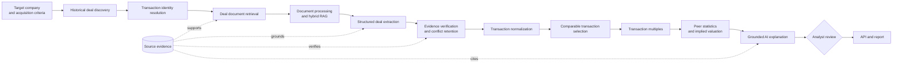

# Precedent Transactions Agent

Project 4 answers a specific M&A question:

> What have acquirers historically paid for businesses comparable to our target, and what does
> that imply for the target's valuation?

The intended V1 is an evidence-grounded research and valuation system. It will discover historical
deals, retrieve transaction documents, extract and verify deal facts, normalize point-in-time
financials, select comparable acquisitions, calculate transaction multiples deterministically, and
produce an auditable analyst explanation.

This directory currently implements **M0 only**: architecture and transaction data contracts. It
does not discover deals, retrieve documents, call an LLM, calculate enterprise value or multiples,
select precedents, run LangGraph, expose an API, or render a frontend.

## Roadmap

| Milestone | Scope | Status |
| --- | --- | --- |
| M0 | Architecture and transaction data models | Implemented on this branch |
| M1/2 | Historical deal discovery and document intelligence/RAG | Planned |
| M3 | Structured extraction, financial normalization, verification | Planned |
| M4/5 | Comparable selection, transaction multiples, implied valuation | Planned |
| M6/7 | LangGraph, human review, evaluation, API/demo, V1 | Planned |

## End-to-end architecture



LangGraph will coordinate the workflow in M6/7. M0 defines only the serializable state shape in
`PrecedentWorkflowState`; it contains no graph, nodes, tools, checkpoint store, or retry loop.
Detailed planned nodes, transitions, approvals, and failures are in
[`docs/architecture.md`](docs/architecture.md).

## Implemented package

`src/ma_precedent_transactions/` contains:

- `domain.py`: immutable transaction, party, lifecycle, value, ownership, financial, selection,
  and future multiple contracts;
- `serialization.py`: schema-versioned JSON-safe round trips that preserve `Decimal`, dates,
  timestamps, enums, tuples, and evidence;
- `workflow.py`: the planned orchestration state contract only;
- `fixtures.py`: six fictitious offline transaction cases;
- `config.py`: conservative M0 defaults that disable automatic FX and partial-stake gross-up;
- `errors.py`: package, validation, and serialization error types.

No provider or retrieval protocol is included in M0. A useful protocol requires concrete M1/2
request and response types; adding one now would be speculative. Future provider clients will sit
behind narrow Project 4 interfaces and return Project 4 domain objects.

## Transaction identity

`TransactionIdentity.transaction_id` is an opaque stable identifier assigned to the economic
transaction, not to an article. Its identity context includes the acquirer party, target party,
transaction type, announcement date when known, and an optional qualifier. Two sources about the
same bid attach evidence and observations to one record.

The target name is never the identity key. M1/2 resolution will need to distinguish:

- competing bidders for the same target;
- an amended offer from a separate bid;
- withdrawn or terminated offers;
- repeated acquisitions of the same legal entity;
- partial purchases and later stake increases;
- asset or business-unit purchases from whole-company acquisitions.

M0 deliberately does not encode a matching algorithm. A qualifier such as `initial bid` helps
retain ambiguity without pretending it resolves identity.

## Parties and transaction structure

`TransactionParty` supports a legal name, aliases, listing information, geography, industry,
description, public/private status, external identifiers, and evidence. Optional fields use
`None`; incomplete data is explicit. `TransactionRecord` holds separate `acquirer` and `target`
roles and validates them against the identity.

`TransactionStructure` classifies what happened: stock or asset acquisition, merger, majority or
minority investment, remaining-stake purchase, divestiture, or business-unit acquisition. It also
records buyer type and whether control was acquired. Structure is separate from consideration: a
merger may still contain cash and stock components.

## Lifecycle and valuation eligibility

`DealLifecycle` keeps announcement date, completion date, status, status-as-of date, and supporting
evidence distinct. Completion cannot precede announcement; completed deals require a completion
date; withdrawn and terminated deals cannot have one.

Future selection policy will normally treat completed transactions as the core precedent set.
Pending or merely announced transactions may be shown separately, and withdrawn or terminated
offers may inform market history but should be excluded from paid-multiple statistics unless an
analyst explicitly approves a documented alternative use. `unknown` always routes to review.

## Consideration and valuation basis

`ConsiderationComponent` represents cash, shares, contingent payments, earnouts, assumed
liabilities, other consideration, or unknown terms. Each component retains its own amount or
quantity, currency, unit, measurement date, fact status, and evidence. M0 never silently sums
components across currencies, dates, or valuation bases.

`ValuationObservation` keeps these measures separate:

1. headline deal value;
2. equity purchase price/equity consideration;
3. transaction enterprise value;
4. per-share offer price.

Every observation is classified as explicitly disclosed, independently calculated, estimated,
ambiguous, or unavailable. A headline of USD 2 billion is not recast as equity value or enterprise
value. Calculated values must retain assumptions. Multiple observations of the same measure are
allowed, which preserves amendments and source conflicts.

No EV/equity bridge calculation exists in M0.

## Ownership

`OwnershipObservation` independently records pre-deal ownership, the percentage acquired in this
transaction, and post-deal ownership. Each percentage is bounded from 0 to 100. A 20% stake price
remains the price of that stake; M0 does not gross it up.

A defensible future gross-up would require, at minimum, the exact security and rights purchased,
fully diluted capitalization at the measurement date, pre- and post-deal ownership, treatment of
options and convertibles, control or minority premiums, the same currency and date basis, and
evidence that the observed price scales linearly. An analyst-approved policy would still need to
record the calculation trace and caveats.

## Capital structure and target financials

`CapitalStructureSnapshot` can hold dated cash, debt, preferred stock, noncontrolling interest, and
other adjustment observations. A component cannot post-date its snapshot. This prevents a stale or
future balance sheet from silently becoming the announcement-date capital structure.

`FinancialMetric` supports revenue, EBITDA, EBIT, net income, EPS, revenue growth, and EBITDA
margin. It preserves:

- historical versus forecast status;
- fiscal year, calendar year, LTM, or point-in-time period and exact dates;
- reported versus adjusted basis and adjustment label;
- currency and unit, including million, billion, lakh, crore, per-share, and percent;
- measurement date, fact status, and evidence.

Revenue cannot be negative. Negative EBITDA, EBIT, net income, and EPS remain valid observations;
future multiple policy must mark inappropriate denominators as not meaningful rather than create a
fake multiple. A 2022 deal does not automatically use a 2026 metric.

There is no FX conversion, accounting-period equivalence, or forecast fabrication in M0.

## Evidence, confidence, missing data, and conflicts

`EvidenceReference` records document title and type, URL, publisher, publication date, document and
chunk identifiers, page, section/table, text location, retrieval timestamp, extraction method,
excerpt identifier, and an optional short excerpt. The document/chunk fields are compatible with a
future Project 1 adapter without importing Project 1 internals. Full copyrighted documents and
generated indexes must stay outside Git.

Facts use categorical `FactStatus` values: directly disclosed, derived from disclosed information,
extracted but unverified, conflicting, or unknown. Source reliability is a separate categorical
field on the evidence. The model intentionally has no invented probability score.

Unknown is `None`, never zero. Undisclosed valuation uses `ValuationBasis.UNAVAILABLE` with no
amount. Conflicting values remain separate `ValuationObservation` objects linked to their own
sources; the model does not pick a winner silently.

## Comparable selection and transaction multiples

`ComparableSelectionPolicy` distinguishes hard filters from qualitative judgments across industry,
business model, geography, announcement period, size, target revenue, margin, transaction type,
ownership/control, buyer type, and growth. M4/5 will implement decisions and an audit trail.

`TransactionMultipleDefinition` reserves valid numerator/denominator pairs for transaction
EV/revenue, EV/EBITDA, EV/EBIT, and equity value/net income. The future output contract preserves
the numerator observation, denominator metric and period, transaction identity/date through those
references, inclusion status, assumptions, treatment reason, and calculation trace. M0 never
calculates a multiple.

## AI and deterministic boundary

Planned AI work may interpret announcements, extract typed facts, explain comparability, and
summarize caveats. Deterministic Python must validate numbers, normalize units, implement supported
EV bridges, calculate multiples and statistics, and derive implied valuations. An LLM may propose
or explain; it may not invent missing values, convert currencies silently, override validated
numbers, or approve its own exceptions.

Planned capability placement:

| Milestone | AI engineering capability |
| --- | --- |
| M1/2 | Deal discovery tools; ingestion; provenance-aware chunking; embeddings; vector, BM25, and hybrid retrieval; source grounding; LangChain integration where it simplifies composition |
| M3 | Typed LLM extraction; evidence linking; verification; conflict retention; explicit extraction failures |
| M4/5 | Semantic comparable reasoning plus deterministic screening, multiple calculations, statistics, and grounded explanation |
| M6/7 | LangGraph state and routing; tools; checkpointing; bounded retries; human review; evaluation; tracing; API |

LangChain is optional connective code, not a domain dependency. LangGraph is reserved for the
stateful, conditional, reviewable workflow in M6/7. No artificial agents are planned.

## Integration with Projects 1–3

Project 4 owns its domain and imports no private code from earlier projects. Reuse findings and
compatibility issues are documented in [`docs/integrations.md`](docs/integrations.md). In brief:

- Project 1 can later supply document, chunk, retrieval, and citation data through an adapter.
- Project 2 offers patterns for provider-neutral discovery, identity evidence, deterministic
  screening, LangGraph state, retries, checkpointing, and human review.
- Project 3 supplies proven semantic conventions for `Decimal`, currency, units, financial periods,
  metric basis, capital structure, multiple definitions, calculation traces, and valuation output.

Direct imports would couple independently packaged projects and are intentionally avoided. Trading
comparables use timestamped public-market values; precedent transactions use historical negotiated
deal values, ownership, lifecycle, and consideration. Project 4 does not inherit public share-price
assumptions.

## Fixtures

`synthetic_transactions()` returns six wholly fictitious, offline examples:

1. a 100% cash acquisition;
2. mixed cash and stock consideration;
3. an incremental partial-stake acquisition with no gross-up;
4. an announced but withdrawn deal;
5. a completed deal with undisclosed value;
6. a deal retaining two conflicting headline-value observations.

## Run M0 checks

From `04_precedent_transactions/`, using Python 3.11+:

```powershell
py -3.11 -m pip install -e ".[dev]"
py -3.11 -m ruff check .
py -3.11 -m ruff format --check .
py -3.11 -m mypy
py -3.11 -m pytest
```

All tests are offline and make no API or LLM calls.

## M0 limitations

M0 provides representation and validation, not correctness of source facts. Transaction identity
resolution, document storage policy, extraction prompts, source-ranking policy, value verification,
FX policy, EV bridges, partial-stake treatment, comparable selection, calculations, orchestration,
evaluation, API, UI, and deployment remain later milestones.
