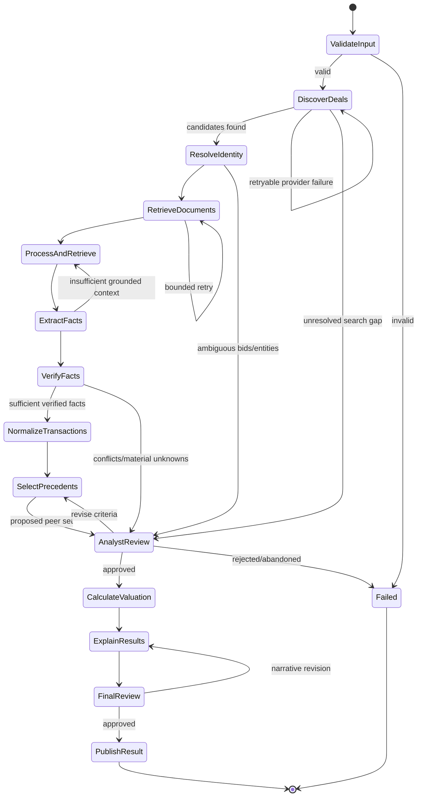

# Architecture and orchestration contract

## Module boundaries

The final system should keep the following boundaries even if implementations change:

| Boundary | Owns | Planned milestone |
| --- | --- | --- |
| `discovery` | Search criteria, provider adapters, candidate observations | M1/2 implemented |
| `identity` | Entity and transaction resolution proposals, ambiguity | M1/2 preliminary implementation |
| `documents` | Retrieval, parsing, chunking, source metadata | M1/2 text/HTML plus PDF adapter |
| `retrieval` | Vector, keyword/BM25, hybrid ranking, grounded context | M1/2 implemented offline |
| `extraction` | Typed LLM outputs linked to evidence | M3 |
| `verification` | Conflicts, source checks, acceptance/rejection | M3 |
| `normalization` | Units, periods, supported capital bridge inputs | M3 |
| `selection` | Hard filters, qualitative assessments, analyst overrides | M4/5 |
| `valuation` | Multiple definitions, calculations, statistics, implied values | M4/5 |
| `explanation` | Evidence-grounded narrative over deterministic results | M4/5 |
| `workflow` | LangGraph state, routing, retries, checkpoints, review | M6/7 |
| `api` | Validated external request and response contracts | M6/7 |

The domain package remains provider-neutral. Provider-specific payloads stop at adapters. Earlier
portfolio projects remain separate packages, connected only by narrow adapters owned by Project 4.

## Planned LangGraph

M0 implements `PrecedentWorkflowState` only. The planned graph is:

### Entry and state

The graph enters with target context and an acquisition/comparability policy. State will retain
discovered deal IDs, retrieved document IDs, extracted observation IDs, verified transaction
records, selected precedent IDs, valuation result IDs, warnings, errors, analyst decisions,
evidence references, per-stage retry counts, and workflow status.

Large documents, embeddings, and generated indexes belong in external stores. State carries stable
IDs and compact contracts, not source binaries.

### Retry boundaries

Retries are limited to transient discovery, retrieval, parsing, model, and storage failures. Each
stage owns a small explicit retry budget and records attempts. Validation failures, unsupported
currency/basis combinations, unresolved conflicts, and missing required financials are not retried
blindly; they route to review, exclusion, or a terminal failure.

### Human checkpoints

Human approval is planned after material identity conflicts, material fact conflicts, proposed
precedent selection, and final valuation/explanation. Decisions record checkpoint, outcome, and
rationale. Analysts can revise criteria or reject a deal; an LLM cannot waive deterministic
validation.

### Terminal conditions and failure states

Success requires an approved result with a complete evidence manifest and deterministic
calculation traces. A valid result may contain warnings or an explicit "insufficient precedents"
outcome. Terminal failures include invalid input, exhausted provider/model retries, unrecoverable
state corruption, and analyst rejection. Missing EBITDA alone is not a workflow crash; it makes the
corresponding multiple unavailable.

## RAG and LangChain plan

M1/2 will ingest transaction announcements, filings, agreements, presentations, annual reports,
and exchange disclosures. Provenance-aware chunks will carry document, page, section/table, and
text locators. Retrieval will combine semantic vectors with keyword/BM25 signals because exact
terms such as offer price, debt assumed, and stake percentage matter alongside semantic meaning.

LangChain may compose loaders, retrievers, and typed extraction calls where it reduces integration
code. Domain objects, validation, evidence policy, and calculations remain ordinary Python and do
not depend on LangChain. Retrieved passages must link back to `EvidenceReference` before they can
support a fact.

## Determinism

LLM outputs are proposals at extraction, qualitative comparison, and explanation boundaries.
Parsing numeric strings, validating dates/currencies/units, resolving supported unit conversions,
building EV bridges, calculating multiples/statistics, and computing implied valuation ranges are
deterministic functions with explicit policies and traces.
