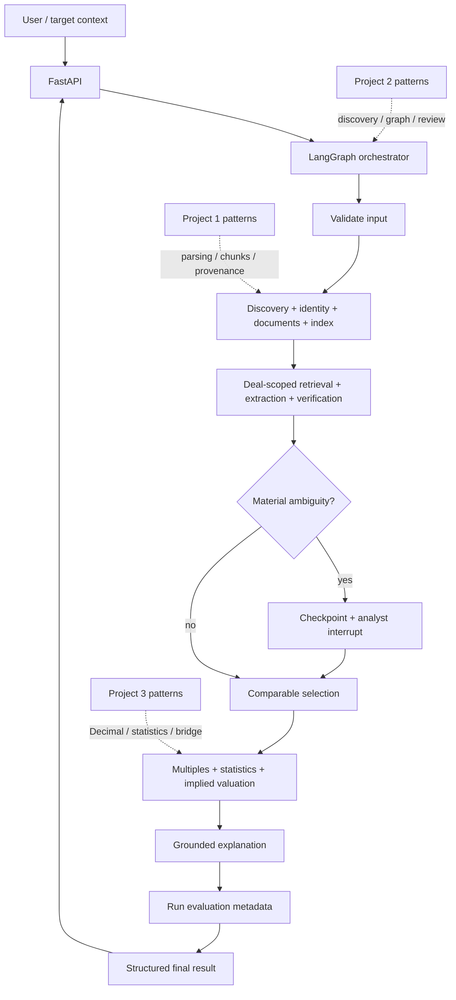

# Final architecture and orchestration

## Implemented boundaries

| Boundary | Responsibility |
| --- | --- |
| `discovery` | Acquisition context, fixture provider, candidate generation, identity resolution |
| `documents` | Source catalog, text/HTML ingestion, optional Project 1 PDF adapter, chunks |
| `retrieval` | Deterministic semantic vectors, BM25, hybrid fusion, filters, provenance |
| `extraction` | Evidence-bounded structured observations, normalization, verification, conflicts |
| `precedent` | Eligibility, soft assessment, overrides, multiples, statistics, valuation, explanation |
| `workflow` | LangGraph state, routing, retries, checkpointing, review, final result |
| `api` | Strict HTTP schemas and run/review lifecycle |

Provider payloads stop at adapters. The graph calls these services rather than embedding their
business rules in nodes.

## Typed state

`WorkflowState` carries a `WorkflowRequest`, compact `DealResearchCorpus`, evidence bundles,
verified and valuation-ready transactions, review request and decision, selection, multiples,
valuation output, run evaluation metadata, warnings, structured issues, retry counters, trace, and
terminal result. Large source binaries and external indexes are not checkpoint payloads.

`PrecedentWorkflowResult` exposes target/request context, discovered research metadata, verified
transactions, included and excluded precedents, multiples, ranges, evidence, review audit, warnings,
errors, evaluation metadata, and trace through a compact presentation contract.

## Nodes and routing

The compiled graph uses ten nodes:

1. `validate_input`
2. `research_deals`
3. `extract_and_verify`
4. `route_for_human_review`
5. `human_review`
6. `select_precedents`
7. `calculate_valuation`
8. `generate_explanation`
9. `evaluate_run`
10. `finalize`

No-deal, exhausted-retrieval, extraction, no-precedent, valuation, rejection, and invalid-review
paths terminate through `finalize`. Recoverable research and extraction failures loop only within
their configured retry budgets. Deterministic validation or finance failures are not retried.

## Human review and checkpointing

Review policies are `WHEN_NEEDED`, `ALWAYS`, and `NEVER`. Material triggers include unresolved
source conflicts, ambiguous deal-value basis, and minority/partial-stake structure. LangGraph
`interrupt` pauses after the review request has been checkpointed. Resume accepts approval or
rejection, conflict resolutions that cite a known observation ID, and force-include/force-exclude
overrides with rationale.

V1 uses `InMemorySaver` with a trusted same-process serializer so frozen domain objects survive
resume. The serializer must never load untrusted bytes. Durable or shared deployment requires a
different secured checkpointer.

## Failure and trace contracts

`FailureCode` includes `INVALID_INPUT`, `NO_DEALS_FOUND`, `RETRIEVAL_INSUFFICIENT`,
`EXTRACTION_FAILED`, `VERIFICATION_BLOCKED`, `HUMAN_REVIEW_REQUIRED`,
`NO_ELIGIBLE_PRECEDENTS`, `VALUATION_UNAVAILABLE`, `EXPLANATION_FAILED`, and `USER_REJECTED`.

Trace events contain node, public status, short message, duration, retry count, and aware timestamp.
They are operational audit data, not hidden model reasoning. Logging records node lifecycle and
counts without source passages, secrets, or chain-of-thought.

## LangChain and deterministic logic

LangChain-compatible adapters are limited to native structured extraction and explanation output.
LangGraph owns orchestration. Deterministic Python owns parsing, units, dates, conflicts, selection
filters, EV bridges, multiples, percentiles, implied values, and all calculation traces. Model
failure cannot change or invalidate already computed numbers.
