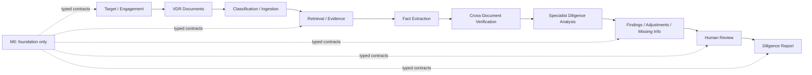

# AI Due-Diligence Agent

## Problem

M&A diligence involves facts spread across financial statements, contracts, management materials,
data exports, and follow-up responses. A useful system must retain what sources say, expose
disagreement, distinguish facts from interpretation, keep unknown values unknown, and preserve
analyst decisions. A document summary alone cannot do that.

## Project Goal

Project 5 will become an evidence-first assistant for investigating a target-company virtual data
room, organizing materials, finding conflicts and gaps, supporting specialist analysis, quantifying
deterministic adjustments, and preparing an auditable diligence report for human approval.

M0 implements only the typed domain and architectural foundation. It does not ingest production
documents, call an LLM, calculate QoE, run LangGraph, expose an API, or generate a report.

## M&A Due-Diligence Workflow

The future workflow establishes the engagement and scope, registers VDR documents, retrieves
evidence, extracts atomic candidate facts, compares facts across documents, develops workstream
findings and financial candidates, routes judgments to an analyst, and assembles approved content.

## Architecture



Frozen dataclasses and string enums form the provider-neutral domain. Narrow protocols reserve
future provider and analyzer boundaries. Schema-versioned serialization retains enums, `Decimal`,
dates, timestamps, and tuples. The future graph state is a typed contract only.

## Workstreams

The taxonomy covers financial, commercial, legal/contractual, and operational diligence. Tax, HR,
technology, cyber, regulatory, and ESG are extension categories; M0 does not implement specialist
analysis for them.

## Domain Models

- `DiligenceEngagement` records the target, optional buyer, transaction, scope, reporting currency,
  as-of date, materiality assumptions, and review status.
- `VdrDocument` records identity, document type, workstreams, entity, period, version,
  confidentiality, parse state, source metadata, and optional checksum.
- `DiligenceFact` represents one numeric, textual, date, or Boolean observation. Missing facts have
  `value=None`; unknown never becomes zero.
- `DiligenceFinding` represents an analyst-relevant conclusion with facts, evidence, severity,
  materiality, support, impact areas, risk context, and follow-up.

## Evidence / Provenance

`EvidenceReference` identifies a document or external source and may locate pages, section, table,
row, column, chunk, source-text span, period, and retrieval context. `ProvenanceChain` makes lineage
explicit: `Finding or Adjustment -> Fact -> Evidence -> Document`. Derived facts additionally
reference deterministic derivation metadata and input facts.

## Findings and Risks

Finding types distinguish red flags, risks, inconsistencies, adjustments, missing information,
follow-up needs, positive findings, and informational observations. Risks use qualitative likelihood
and narrative rationale, avoiding synthetic numeric confidence. Deal-impact categories include
valuation, purchase price, QoE, net debt, working capital, legal protections, closing, integration,
deal thesis, financing, and post-close operations.

## Severity / Materiality

Severity expresses the seriousness of a finding using unassessed, low, medium, high, or critical.
Materiality is modeled separately and may retain a qualitative band, amount, percentage with its
benchmark, threshold, and rationale. M0 does not infer one from the other or calculate either.

## Financial Adjustments

`FinancialAdjustment` records a proposed type, metric, nonnegative amount, explicit direction,
period, recurrence, evidence, support status, and analyst decision. `BalanceSheetItem` prepares
working-capital, debt-like, cash-like, and off-balance-sheet classifications. M0 performs no QoE,
working-capital, or net-debt calculation.

## Missing Information

`MissingInformation` retains the requested item, workstream, importance, reason, status, blocking
flag, and follow-up wording. `FollowUpQuestion` supports a structured request list and can later
retain responses with evidence.

## Human Review

`HumanReviewAction` records reviewer, action, rationale, timezone-aware timestamp, subject, prior
state, and resulting state. Actions cover finding approval/rejection, severity changes, adjustment
decisions, conflict resolution, nonmaterial conclusions, and requests for more evidence. M0 does
not implement the interactive workflow.

## Report / Summary Contracts

`ReportSectionContract` defines future report sections and their referenced findings, adjustments,
missing items, limitations, workstream, and approval requirement. `DiligenceSummary` and
`WorkstreamSummary` provide typed counts and review status for future graph, API, and reporting
layers. They contain structured state only and generate no report text in M0.

## AI vs Deterministic Logic

Future AI assistance may classify documents, interpret text, propose candidate facts and red flags,
compare semantic statements, draft grounded explanations, and propose follow-up questions. These
outputs remain candidates tied to evidence and review status.

Deterministic Python will own arithmetic, normalization, reconciliation, QoE, working-capital and
net-debt calculations, thresholds, rule-based checks, and explicit severity/materiality policies.
The LLM will not be the authoritative calculator.

## Relationship to Projects 1–4

M0 has no runtime imports from Projects 1–4. Those are independent packages without a shared stable
API. Project 5 adapts their proven patterns inside its own bounded context and exposes protocols for
later adapters. See [Project 1–4 reuse](docs/project-1-4-reuse.md).

## Development

```powershell
py -3.11 -m venv .venv
& .\.venv\Scripts\python.exe -m pip install -e ".[dev]"
& .\.venv\Scripts\python.exe -m ruff check .
& .\.venv\Scripts\python.exe -m ruff format --check .
& .\.venv\Scripts\python.exe -m mypy
& .\.venv\Scripts\python.exe -m pytest
```

The offline Northstar fixture covers clean financial data, conflicting revenue, an EBITDA add-back,
customer concentration, a change-of-control clause, missing debt data, debt-like and working-capital
items, a high-severity finding, and an analyst review action.

## Roadmap

- **M0 — Architecture + Due-Diligence Data Models: implemented**
- **M1/2 — Virtual Data Room Intelligence + RAG: planned**
- **M3 — Financial Due Diligence + Quality of Earnings: planned**
- **M4/5 — Specialist Due-Diligence Agents + Cross-Document Risk Investigation: planned**
- **M6/7 — LangGraph Orchestration + Human Review + Diligence Report + Evaluation + API/Demo: planned**
