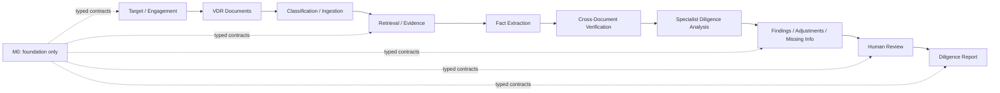

# AI Due-Diligence Agent

## Problem

M&A diligence involves facts spread across financial statements, contracts, management materials,
data exports, and follow-up responses. A useful system must retain what sources say, expose
disagreement, distinguish facts from interpretation, keep unknown values unknown, and preserve
analyst decisions. A document summary alone cannot do that.

## Project Goal

Project 5 will become an evidence-first assistant for investigating a target-company virtual data
room, organizing materials, finding conflicts and gaps, supporting specialist analysis, quantifying
deterministic adjustments, and preparing an auditable diligence report for human approval.

M0 implements the typed domain foundation. M1/2 adds offline VDR ingestion, structure-aware
chunking, deterministic indexing, hybrid evidence retrieval, bounded RAG context construction,
evaluation, and a reproducible demo. M3 adds evidence-bound financial observations, source
reconciliation, QoE adjustment assessment, EBITDA, working-capital and net-debt bridges, financial
findings, evaluation, and an offline demo. M4/5 adds evidence-bound specialist analyzers,
cross-document investigation, finding consolidation, compound risks, and information requests.
LangGraph, final human review, API, and final reporting remain later milestones.

## M&A Due-Diligence Workflow

The future workflow establishes the engagement and scope, registers VDR documents, retrieves
evidence, extracts atomic candidate facts, compares facts across documents, develops workstream
findings and financial candidates, routes judgments to an analyst, and assembles approved content.

## Architecture



Frozen dataclasses and string enums form the provider-neutral domain. Narrow protocols reserve
future provider and analyzer boundaries. Schema-versioned serialization retains enums, `Decimal`,
dates, timestamps, and tuples. The future graph state is a typed contract only.

M1/2 implements the left side through evidence retrieval. M3 implements deterministic financial
analysis and candidate financial findings. M4/5 implements specialist conclusions and
cross-document investigation. Final orchestration and review remain later work.

## Specialist Diligence and Investigation

M4/5 provides financial, commercial, legal/contractual, and operational analyzers behind one typed
interface. Each analyzer has an explicit retrieval plan and receives only relevant evidence plus
shared claims and prior structured results. The financial specialist consumes M3 outputs without
recalculating them.

The cross-document investigator compares typed claims with period, entity, version, and source
authority context. It retains unresolved numeric, Boolean, and date conflicts; marks older document
revisions as superseded; and never overwrites a source value. Consolidation merges overlapping
findings while retaining contributing agents and evidence. A bounded rule combines customer
concentration, near-term expiry, and change-of-control consent into one compound candidate risk.

Specialists also emit missing-information items and follow-up questions. The coordinator isolates
agent failures, prepares a consolidated request list, and builds a full finding-to-document trace.
Optional explanation providers may only cite evidence already attached to a finding.

See [Specialist diligence and investigation](docs/specialist-agents-investigation.md). Run
`madd-specialist-demo` for the offline workflow and ten-category evaluation.

## Financial Due Diligence and Quality of Earnings

M3 retrieves financial evidence through M1/2 and retains metric, value, currency, unit, period,
actual/forecast status, reported/adjusted basis, source, evidence, and support status in typed
observations. A deterministic extractor is available offline, with a validated optional provider
boundary for LLM candidates.

Source reconciliation preserves audited, management, board, presentation, sales, debt, and bank
observations instead of overwriting disagreements. The visible source-priority policy is
configurable by metric. Period and currency mismatches remain unresolved without implicit FY/LTM
or FX conversion.

QoE rules assess recurring add-backs, duplicates, missing evidence, and unrealized run-rate items.
Only accepted adjustments enter the deterministic reported-to-diligence-adjusted EBITDA bridge.
Other deterministic services calculate revenue growth, gross and EBITDA margins, customer
concentration, historical NWC, indicative NWC peg, and adjusted net debt while preserving complete
calculation lines.

Candidate financial findings cover material revenue discrepancies, concentration, repeated
one-time items, working-capital volatility, and restricted cash. See
[Financial diligence and QoE](docs/financial-diligence-qoe.md).

Run `madd-financial-demo` for the end-to-end offline M3 demonstration.

## VDR Ingestion

`VdrIngestionPipeline` accepts a folder, an explicit file list, or a typed/JSON manifest. Each file
is hashed, parsed, classified, chunked, and added independently so a corrupt or unsupported file
does not discard the usable corpus. The corpus remains tied to one engagement.

Supported formats are PDF, UTF-8 TXT/Markdown, CSV, XLSX, and basic HTML. PDF parsing uses PyMuPDF;
XLSX parsing uses openpyxl; the other parsers use the Python standard library. OCR, legacy `.xls`,
images, archives, and macros are outside M1/2.

## Classification and Metadata

The offline classifier applies visible filename/title/content phrase rules to the M0 document
taxonomy and assigns one primary workstream plus ordered secondary workstreams. A manifest can
override type and workstreams. Ambiguous unmatched documents remain `OTHER` instead of receiving
invented certainty.

Documents retain title, filename, absolute source path, checksum, type, workstreams, entity and
period when supplied/inferred, version markers, retrieval timestamp, confidentiality, format, and
parse status.

## Table and Spreadsheet Handling

CSV and XLSX rows remain atomic parsed elements. Chunks retain table ID, sheet name, row number,
cell range, and header context. XLSX ingestion reads displayed values with `data_only=True`; it does
not evaluate formulas, reconstruct formatting, or provide a full Excel engine. PDF table handling
is intentionally heuristic and does not attempt OCR or geometric table reconstruction.

## Diligence-Aware Chunking

Narrative paragraphs, headings, contract clauses, PDF table-like rows, CSV rows, and spreadsheet
rows are represented separately. Contract clause numbers and section headings remain attached.
Table rows include their headers so periods and numeric values stay together. Every chunk carries
engagement, document, type, workstreams, pages/indexes, section, clause, table/sheet/range, period,
entity, source path, and a deterministic content fingerprint.

## Semantic, Lexical, and Hybrid Retrieval

The offline `DeterministicHashEmbedder` provides normalized feature-hashing vectors for tests and
the demo. It is a replaceable semantic-retrieval boundary, not a production embedding model.

Lexical search uses BM25 over normalized tokens and phrase bigrams. Hybrid retrieval combines
nonnegative cosine similarity and max-normalized BM25 using transparent weights: 55% semantic and
45% lexical. Deterministic score and chunk-ID ordering resolves ties.

Filters support engagement, document ID, document type, workstream, period, entity, page, and sheet.
Engagement filtering is mandatory. Cross-document retrieval groups evidence by source without
selecting an authoritative value.

## Retrieval Signals and RAG Context

Responses can flag no evidence, weak matches, single-source support, conflicting contexts, stale
period filters, wrong-workstream filters, duplicate evidence, and corpus parse failures. These are
review signals rather than confidence percentages.

`RagContextBuilder` retrieves, deduplicates, applies filters, preserves citations, and fits evidence
into a character budget. M1/2 does not generate an answer; later extraction and analysis consume
this grounded context.

## Index Lifecycle and Versions

The lifecycle is `ingest -> parse -> classify -> chunk -> index -> retrieve`. Index updates validate
all pending vectors before mutation and support explicit rebuilding. SHA-256 detects renamed exact
duplicates, which are recorded and skipped. Distinct `v1`, `v2`, `revised`, `draft`, and `final`
documents remain available and are grouped as versions rather than overwritten.

## Retrieval Evaluation

The seven-case synthetic benchmark covers narrative and table evidence. Current offline results at
K=5 are Hit@5 `1.000`, Recall@5 `0.929`, MRR `0.857`, source correctness `0.714`, metadata-filter
correctness `1.000`, and narrative/table Hit@5 `1.000`. This tiny fixture benchmark validates
plumbing and regression behavior; it does not establish production retrieval quality.

## Offline Demo

Run `madd-vdr-demo`. It generates the fictitious VDR, ingests and indexes it, retrieves revenue,
customer, contract, debt, and EBITDA-adjustment evidence, groups unresolved revenue contexts by
source, builds bounded RAG context, demonstrates insufficient evidence, and runs the benchmark.

## Workstreams

The taxonomy covers financial, commercial, legal/contractual, and operational diligence. Tax, HR,
technology, cyber, regulatory, and ESG are extension categories; M0 does not implement specialist
analysis for them.

## Domain Models

- `DiligenceEngagement` records the target, optional buyer, transaction, scope, reporting currency,
  as-of date, materiality assumptions, and review status.
- `VdrDocument` records identity, document type, workstreams, entity, period, version,
  confidentiality, parse state, source metadata, and optional checksum.
- `DiligenceFact` represents one numeric, textual, date, or Boolean observation. Missing facts have
  `value=None`; unknown never becomes zero.
- `DiligenceFinding` represents an analyst-relevant conclusion with facts, evidence, severity,
  materiality, support, impact areas, risk context, and follow-up.

## Evidence / Provenance

`EvidenceReference` identifies a document or external source and may locate pages, section, table,
row, column, chunk, source-text span, period, and retrieval context. `ProvenanceChain` makes lineage
explicit: `Finding or Adjustment -> Fact -> Evidence -> Document`. Derived facts additionally
reference deterministic derivation metadata and input facts.

## Findings and Risks

Finding types distinguish red flags, risks, inconsistencies, adjustments, missing information,
follow-up needs, positive findings, and informational observations. Risks use qualitative likelihood
and narrative rationale, avoiding synthetic numeric confidence. Deal-impact categories include
valuation, purchase price, QoE, net debt, working capital, legal protections, closing, integration,
deal thesis, financing, and post-close operations.

## Severity / Materiality

Severity expresses the seriousness of a finding using unassessed, low, medium, high, or critical.
Materiality is modeled separately and may retain a qualitative band, amount, percentage with its
benchmark, threshold, and rationale. M0 does not infer one from the other or calculate either.

## Financial Adjustments

`FinancialAdjustment` records a proposed type, metric, nonnegative amount, explicit direction,
period, recurrence, evidence, support status, and analyst decision. `BalanceSheetItem` prepares
working-capital, debt-like, cash-like, and off-balance-sheet classifications. M0 performs no QoE,
working-capital, or net-debt calculation.

## Missing Information

`MissingInformation` retains the requested item, workstream, importance, reason, status, blocking
flag, and follow-up wording. `FollowUpQuestion` supports a structured request list and can later
retain responses with evidence.

## Human Review

`HumanReviewAction` records reviewer, action, rationale, timezone-aware timestamp, subject, prior
state, and resulting state. Actions cover finding approval/rejection, severity changes, adjustment
decisions, conflict resolution, nonmaterial conclusions, and requests for more evidence. M0 does
not implement the interactive workflow.

## Report / Summary Contracts

`ReportSectionContract` defines future report sections and their referenced findings, adjustments,
missing items, limitations, workstream, and approval requirement. `DiligenceSummary` and
`WorkstreamSummary` provide typed counts and review status for future graph, API, and reporting
layers. They contain structured state only and generate no report text in M0.

## AI vs Deterministic Logic

Future AI assistance may classify documents, interpret text, propose candidate facts and red flags,
compare semantic statements, draft grounded explanations, and propose follow-up questions. These
outputs remain candidates tied to evidence and review status.

Deterministic Python will own arithmetic, normalization, reconciliation, QoE, working-capital and
net-debt calculations, thresholds, rule-based checks, and explicit severity/materiality policies.
The LLM will not be the authoritative calculator.

## Relationship to Projects 1–4

M0 has no runtime imports from Projects 1–4. Those are independent packages without a shared stable
API. Project 5 adapts their proven patterns inside its own bounded context and exposes protocols for
later adapters. See [Project 1–4 reuse](docs/project-1-4-reuse.md).

M1/2 adapts Project 1's conservative normalization, page/index provenance, provider-neutral
embedding boundary, and retrieval contracts. It adapts Project 4's BM25, weighted hybrid fusion,
metadata filters, atomic index updates, and quality warnings. No private cross-project module is
imported. See [VDR intelligence and RAG](docs/vdr-intelligence-rag.md).

M4/5 adapts Project 4's retained-conflict, source-priority, grounded-explanation, and failure-data
patterns. It adds no cross-project runtime import and no LangChain or LangGraph dependency. See
[Project 1–4 reuse](docs/project-1-4-reuse.md).

## Development

```powershell
py -3.11 -m venv .venv
& .\.venv\Scripts\python.exe -m pip install -e ".[dev]"
& .\.venv\Scripts\python.exe -m ruff check .
& .\.venv\Scripts\python.exe -m ruff format --check .
& .\.venv\Scripts\python.exe -m mypy
& .\.venv\Scripts\python.exe -m pytest
```

The offline Northstar fixture covers clean financial data, conflicting revenue, an EBITDA add-back,
customer concentration, a change-of-control clause, missing debt data, debt-like and working-capital
items, a high-severity finding, and an analyst review action.

## Roadmap

- **M0 — Architecture + Due-Diligence Data Models: implemented**
- **M1/2 — Virtual Data Room Intelligence + RAG: implemented**
- **M3 — Financial Due Diligence + Quality of Earnings: implemented**
- **M4/5 — Specialist Due-Diligence Agents + Cross-Document Risk Investigation: implemented**
- **M6/7 — LangGraph Orchestration + Human Review + Diligence Report + Evaluation + API/Demo: planned**
