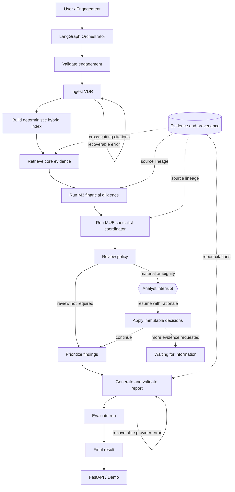

# Final Agent Architecture

## Scope

M6/7 composes Project 5's implemented VDR, retrieval, finance, specialist, investigation, and
consolidation services into a reviewable Version 1 workflow. It adds orchestration, human review,
reporting, run evaluation, an offline demo, and a local API. It does not add tax, cyber, external
market research, production identity, distributed execution, or autonomous deal decisions.

## Workflow

Graph nodes are deliberately thin. VDR parsing and retrieval stay in M1/2, arithmetic stays in M3,
and workstream analysis and cross-document investigation stay in M4/5. The graph only sequences
calls, routes failures and review, and records state.

## State and Checkpointing

The typed state carries the request, corpus, documents, index, retrieved evidence, deterministic
financial snapshot, specialist output, conflicts, review request/submission/actions, prioritized
findings, report, evaluation metadata, warnings, structured errors, retry counters, and trace.

The V1 checkpointer is `InMemorySaver` with a trusted same-process pickle serializer. It preserves
frozen domain objects and supports genuine LangGraph `interrupt`/`Command` resume semantics. It is
suited to tests and a local demonstration. Production use needs a durable encrypted saver,
authenticated actor identity, authorization, retention controls, and a migration policy.

## Review Policy and Decisions

`when_needed` routes unresolved source conflicts, compound risk, high or critical uncertainty, and
urgent or blocking missing information to review. `always` forces a review; `never` records any
warnings and continues without an interrupt.

Supported V1 actions are approve finding, reject finding, change severity, mark nonmaterial,
resolve conflict by selecting one retained observation, and request more evidence. Actions create
`HumanReviewAction` records containing prior and resulting fields. Rejected findings remain in the
audit set with closed status. Requests for more evidence stop before report generation.

## Report Design

Risk priority uses an explainable stable sort: severity, selected deal-impact categories, support
ambiguity, and finding ID. Critical items and high items with conflicts, closing impact, or compound
customer risk receive immediate priority. Other high items receive high priority.

Each report finding is built from a structured finding and its evidence. Citations include document,
page/section/table/sheet/cell/chunk locators when available. Financial values are copied from the M3
EBITDA, customer concentration, NWC, and net-debt results. Validation rejects missing material
findings, unknown citations, numerical drift, or missing limitations. An optional narrative provider
can phrase grounded input; deterministic assembly remains the default.

## Failure Handling and Observability

Stable failure codes distinguish invalid input, no documents, ingestion, retrieval, finance,
specialist, review, missing information, and report failures. Ingestion and report generation have
bounded retry policies. Parser failures remain corpus issues, and specialist-level exceptions remain
agent errors. Each graph node records timestamp, duration, status, message, and retry count.

## API

The local FastAPI interface exposes:

- `GET /health`
- `POST /diligence/runs`
- `GET /diligence/runs/{run_id}`
- `POST /diligence/runs/{run_id}/review`
- `GET /diligence/runs/{run_id}/report`

The API is deliberately fixture-only and credential free because the default M3 workflow adapter
uses the deterministic synthetic finance case. Custom VDR execution requires injecting a financial
extraction adapter at the service boundary. The registry and checkpoints are process local. There
is no authentication, persistence, queue, rate limiting, uploaded-file endpoint, or multi-tenant
authorization in V1.

## AI and Deterministic Boundary

AI may later classify text, propose facts and risks, compare semantic claims, and draft grounded
wording. Deterministic Python owns file identity, filtering, arithmetic, reconciliation, thresholds,
review routing, priority policy, citation validation, and report consistency. The current final demo
uses no live model or network call.

## Evaluation

The final suite contains 14 separately reported scenarios across ingestion quality, retrieval
relevance, evidence accuracy, financial calculation, finding detection, contradiction and version
handling, human review, report consistency, and end-to-end completion. It is a small synthetic
regression benchmark, not a claim of production diligence accuracy.

The scenario inventory also retains expected behavior for the 14 final cases: a clean case
completes; revenue disagreement remains a conflict; repeated add-backs are challenged; customer
concentration plus expiry becomes a compound risk; change-of-control and supplier concentration
become cited findings; debt-like and restricted-cash items remain in deterministic bridges; missing
critical documents trigger requests; revised contracts supersede older claims; specialist failure
is isolated; review pauses and resumes; report-provider failure retries and terminates at its bound;
and a no-material-findings policy path can continue without an interrupt. The automated checks span
these behaviors across the final suite and the focused M1-M5 tests.

## Relationship to Projects 1-4

There are no runtime imports from Projects 1-4. Project 5 adapts Project 1's conservative parsing,
chunking, evidence, and retrieval ideas; Project 2's typed company identity pattern; Project 3's
`Decimal`, currency, unit, period, normalization, and safe calculation patterns; and Project 4's
retained conflicts, grounded explanations, checkpointed LangGraph review, API, and evaluation
architecture. These are conceptual or local adaptations because the earlier projects do not expose
a shared stable package API.

## Production Hardening

Before production use, add durable encrypted checkpoints, object storage, identity and role-based
authorization, malware scanning, file size limits, tenant isolation, secrets management, provider
timeouts and circuit breakers, structured telemetry export, retention/deletion controls, redaction,
prompt-injection defenses, calibrated production evaluations, and qualified legal/accounting review.

## Portfolio Summary and Interview Story

Project 5 demonstrates how to build an M&A diligence system around traceable evidence rather than
free-form summaries. The implementation moves from typed engagement and provenance models, through
multi-format VDR retrieval and deterministic finance, to specialist issue spotting, contradiction
retention, human decisions, and a validated report.

Resume bullets:

- Built an offline, evidence-first M&A due-diligence agent with multi-format VDR ingestion, hybrid
  retrieval, deterministic QoE/NWC/net-debt calculations, and specialist workstream analysis.
- Designed a checkpointed LangGraph workflow with policy-based analyst interruption, immutable
  review audit trails, partial-failure routing, and deterministic report consistency checks.
- Exposed a typed FastAPI proof of concept and a 14-scenario evaluation spanning ingestion,
  retrieval, finance, contradictions, review behavior, and end-to-end reporting.

For Project 6, the clean handoff is the public Project 5 workflow result, report, evidence, and
review contracts. Project 6 should consume those stable outputs through an adapter instead of
importing private implementation modules or copying financial/retrieval logic.
