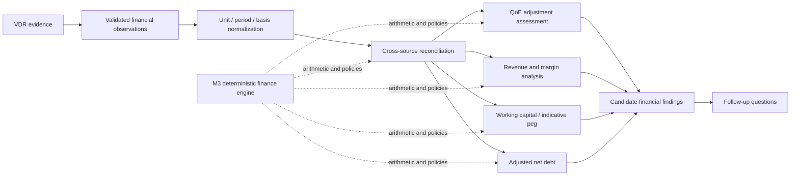

# Financial diligence and quality of earnings

## Workflow

M3 consumes bounded evidence returned by the M1/2 VDR layer. It converts explicit source values
into typed observations, normalizes compatible units, reconciles sources, runs deterministic
calculations, and emits candidate findings and follow-up questions. Evidence references remain
attached throughout. Unknown inputs remain `None` and calculations return partial results with
typed warnings.

## Financial observations and normalization

`FinancialObservation` keeps metric, `Decimal` value, currency, unit, period, actual/forecast
status, reported/management-adjusted/diligence-adjusted basis, document type, evidence, support
status, and extraction method together. Units can be converted explicitly among units, thousand,
million, and billion. Currency conversion is refused without a supplied FX policy. FY, monthly,
and dated LTM periods are parsed but never silently converted into one another.

The deterministic extractor recognizes explicit metric/value statements in bounded retrieval
context. An optional `FinancialExtractionProvider` can supply validated candidates from an LLM.
Candidates without support retain a null value and unverified status. Provider output cannot
perform or override arithmetic.

## Source reconciliation and priority

Reconciliation retains every observation. The default authority order is audited financial
statements, ledger exports, management accounts, formal board material, management presentations,
sales reports, and other schedules. A per-metric override supports cases where a lower-ranked
document is more appropriate. The policy selects a comparison anchor, not unquestionable truth.

Compatible values produce absolute and percentage variance. Period or currency mismatches remain
unresolved and are not forced into a comparison. The material variance threshold defaults to 5%
and is configurable.

## Quality of earnings and EBITDA bridge

QoE assesses the sustainability and decision usefulness of earnings. The engine keeps reported
EBITDA, management-adjusted EBITDA, and diligence-adjusted EBITDA distinct. Management adjustments
are candidates until rule checks and analyst status allow inclusion.

Adjustment checks flag duplicate lines, missing evidence, unrealized run-rate benefits, and
purported one-time categories repeated across periods. The bridge uses only accepted adjustments:

`Reported EBITDA + accepted upward adjustments - accepted downward adjustments = diligence-adjusted EBITDA`

Every adjustment carries an explicit monetary unit. The bridge normalizes its scale before addition
and records each line's sign, source IDs, and evidence. Rejected items remain visible.

## Revenue quality, concentration, and margins

The engine calculates period-over-period revenue growth, gross margin, and EBITDA margin only for
compatible values. Missing inputs and zero denominators return warnings. Customer concentration
calculates largest-customer, top-five, and top-ten shares from source rows and uses a configurable
threshold. M3 does not infer unidentified customers or perform forensic revenue testing.

## Working capital and indicative peg

V1 net working capital is defined as trade receivables plus inventory plus explicitly included
operating current assets, less trade payables and explicitly included operating current
liabilities. Cash, debt, taxes, and other items are not automatically included.

Historical analysis returns period NWC, average, median, recent variance, outliers, and incomplete
history warnings. Indicative peg methods include trailing average, median, and a selected seasonal
period. The result is a configurable indication rather than a universal transaction peg.

## Net debt, debt-like, and cash-like items

The bridge is:

`Reported debt + accepted debt-like items - unrestricted cash - accepted cash-like items = adjusted net debt`

Only accepted, evidenced classifications enter the calculation. Restricted cash is excluded from
available cash and flagged. Proposed, rejected, conflicting, unverified, or missing items remain in
the result without silently changing the bridge.

## Findings, materiality, and follow-up

Candidate findings cover material source conflicts, customer concentration, recurring add-backs,
working-capital volatility, and restricted cash. Quantifiable findings retain absolute values and
ratios to an available benchmark. Severity remains separate from materiality. Each finding carries
observations, evidence or explicit derivation status, calculation lines, uncertainty, impact area,
and a deterministic follow-up template.

## Configurable thresholds

`FinancialThresholds` exposes material source variance, customer concentration, forecast growth,
margin movement, repeated-adjustment count, and NWC deviation thresholds. Defaults exist for the
synthetic case and are visible in code rather than hidden in scoring logic.

## AI and deterministic boundary

AI may propose observations, adjustment categories, debt-like classifications, narrative
interpretations, and question wording. Deterministic Python owns unit normalization, source
variance, ratios, margins, concentration, adjustment inclusion, EBITDA bridge, NWC, peg, net debt,
and materiality ratios. Human review remains a later workflow milestone.

## Failure behavior

The services surface missing revenue or EBITDA, period and currency mismatch, conflicting values,
zero denominators, incomplete NWC history, unavailable debt or cash amounts, duplicate adjustments,
and unsupported cash classification. Safe partial results remain available.

## Evaluation and limitations

The synthetic evaluation reports eleven separate checks: extraction fixture coverage, numeric
normalization, reconciliation, adjustment classification, EBITDA bridge, concentration, NWC,
indicative peg, net debt, findings, and evidence linkage. It is a regression suite, not a claim of
production accounting accuracy.

M3 does not provide forensic accounting, FX conversion, tax diligence, final analyst approval,
specialist agents, LangGraph orchestration, a final report, an API, or a frontend.
