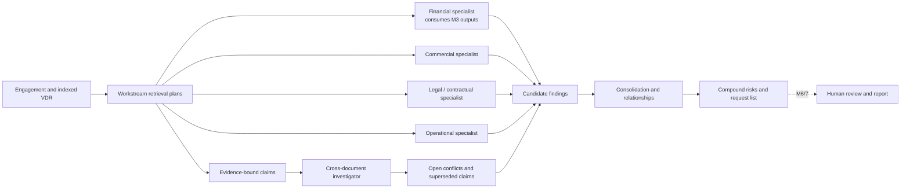

# Specialist diligence and cross-document investigation

## Scope

M4/5 implements deterministic, evidence-bound specialist analysis for financial, commercial,
legal/contractual, and operational workstreams. A lightweight coordinator retrieves relevant
evidence, runs each specialist independently, compares claims, consolidates overlap, creates a
limited compound risk, and prepares a deduplicated information-request list. It is not a LangGraph
runtime, final review workflow, legal opinion, report generator, API, or external market-research
system.

## Specialist contract and retrieval plans

`SpecialistAnalyzer` exposes an agent identity, a `RetrievalPlan`, and
`analyze(SpecialistContext) -> SpecialistResult`. The context contains the engagement, only the
retrieved evidence selected for that specialist, shared evidence-bound claims, facts, existing
findings, authoritative M3 financial outputs, and retrieval warnings. Results contain typed
findings, missing-information items, and follow-up questions rather than prose reports.

The commercial plan targets sales, customer contracts, presentations, board materials, budgets,
and forecasts. The legal plan targets contracts and agreements. The operational plan targets
supplier contracts, HR/operations reports, policies, board materials, and relevant uncategorized
documents. The financial plan targets financial documents and passes M3 findings through without
recalculating their arithmetic.

## Workstream behavior

- **Financial:** translates M3 reconciliation, QoE, concentration, NWC, and net-debt candidate
  findings; it may attach matching VDR evidence to an already-derived M3 finding.
- **Commercial:** identifies concentration, near-term renewal/expiry, and forecast-versus-actual
  growth gaps. It explicitly records that no external market research was performed.
- **Legal/contractual:** spots change-of-control, termination-for-convenience, and assignment
  provisions with clause/document evidence. Its output is issue spotting and not legal advice.
- **Operational:** identifies supplier concentration, single-source dependencies, and limited
  capacity headroom from available VDR sources.

## Facts, claims, and findings

An `InvestigationClaim` is a source assertion with exactly one typed value, source authority,
period, entity, version, effective date, and evidence. A claim remains distinct from a finding.
For example, “Apex represents 42% of revenue” is a numeric claim; “high customer concentration” is
the reviewable finding derived from that claim. Findings retain claim IDs and direct evidence.

## Cross-document investigation

`CrossDocumentInvestigator` groups claims by subject, topic, and entity. It compares current claims
only when value type, unit, and period are compatible. Different periods are marked not comparable.
Newer revisions of the same logical document supersede older claims; both documents remain in the
corpus. Numeric, Boolean, and date mismatches become open conflicts. Source authority may identify
a preferred review candidate, but it never closes the conflict or discards the other claim.

The default authority order is signed contract, audited source, direct schedule, board report,
management accounts, management narrative, and other. This is a review aid rather than an absolute
truth hierarchy.

## Consolidation, links, and compound risk

`FindingConsolidator` merges materially equivalent categories, combines evidence and contributing
agents, and keeps the strongest proposed severity. It keeps materially different findings
separate. Lightweight relationships record when source findings amplify a compound finding.

The M4/5 compound rule requires all three source findings: high customer concentration, a
near-term material-customer expiry, and a change-of-control consent or termination right. The
result preserves all contributing agents, source finding IDs, claim IDs, evidence, and caveats. It
does not predict customer behavior.

## Missing information and requests

Each specialist emits structured gaps. The coordinator converts gaps and finding questions into
one request list, removes normalized duplicates, retains workstreams and related finding IDs, and
keeps the highest priority. The fixture intentionally lacks customer churn history, executed
change-of-control consent, and a supplier business-continuity plan.

## Grounded explanations and trace

`GroundedExplanationService` provides deterministic analyst-style text by default and accepts an
optional structured provider. Provider output is rejected if it changes the finding ID or cites
evidence outside the finding context. Every consolidated finding receives an investigation trace:

`finding -> contributing agents -> facts/claims/conflicts -> evidence -> documents`.

## Failure isolation

Retrieval and analysis errors are recorded per specialist. A failed specialist does not erase
completed outputs from other workstreams. M4/5 does not retry, checkpoint, interrupt, or resume;
those runtime concerns belong to M6/7.

## AI and deterministic boundary

An optional LLM may later interpret clauses, propose semantic risks, draft grounded explanations,
or suggest questions. Provider responses must remain typed and cite supplied evidence.

Deterministic Python owns retrieval filters, numeric comparisons, period compatibility, revision
ordering, source-authority ordering, threshold checks, M3 calculations, deduplication, compound
rules, evidence validation, and trace construction. No LLM is used in tests or the demo.

## LangChain usage

LangChain is not used. The existing repository protocols, dataclasses, retriever, and small
services cover M4/5 without adding framework coupling. LangGraph remains reserved for M6/7.

## Limitations

Rules cover only fixture-backed patterns. Clause extraction is phrase based, semantic conflict
detection is a small Boolean rule set, request deduplication is normalized-text based, and source
authority is configurable only in code. The system performs no external research, legal advice,
forensic accounting, final human adjudication, or final report generation.
