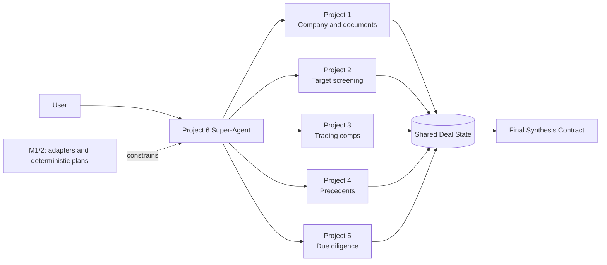
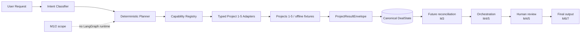

# M&A Deal Intelligence Super-Agent

Project 6 is the capstone coordination layer for the five specialist projects in this repository.
M0 established canonical state and typed integration contracts. M1/2 adds concrete boundary
adapters, a capability registry, offline-first intent classification, deterministic dependency
planning, idempotent result ingestion, and a deliberately small sequential fixture runner.

## Business Problem

An acquisition question spans company research, target sourcing, trading comparables, precedent
transactions, and due diligence. Each discipline has different inputs, evidence, status vocabulary,
financial semantics, and review needs. A deal team needs one durable context that can carry those
outputs without losing ownership or source precision.

## Why a Super-Agent Is Needed

Projects 1–5 are intentionally independent specialists. Project 6 will eventually interpret a
deal-level request, invoke only the needed specialist capabilities, preserve outputs, expose
conflicts, request analyst judgment, and synthesize an evidence-linked answer. M1/2 implements the
selection and planning layer while leaving reconciliation and orchestration to later milestones.



## Projects 1–5 as Specialists

- **Project 1** owns document ingestion, chunking, retrieval, citations, cited answers, and company
  research profiles.
- **Project 2** owns acquisition theses, discovery, enrichment, deterministic eligibility and
  scoring, strategic fit, ranking, and shortlist review.
- **Project 3** owns target financial profiles, peer selection, trading multiples, deterministic
  valuation ranges, calculation traces, and grounded explanations.
- **Project 4** owns transaction discovery and identity, extraction and verification, precedent
  selection, transaction multiples, valuation ranges, and transaction-specific value bases.
- **Project 5** owns VDR intelligence, financial diligence, QoE, adjusted EBITDA, working capital,
  net debt, specialist findings, compound risks, missing information, and diligence review.

The evidence-based [integration matrix](docs/integration-matrix.md) records actual public models,
outputs, dependencies, and incompatibilities found in the current repository.

## Project 6 Responsibility

Project 6 owns canonical entity references, shared deal context, specialist envelopes, cross-project
lineage, workflow and capability status, dependency and staleness metadata, analyst decisions,
future reconciliation, orchestration, and final synthesis metadata.

## What Project 6 Does NOT Reimplement

Project 6 does not parse documents, run retrieval, source or score targets, select peers, calculate
trading or precedent multiples, calculate QoE or diligence bridges, or reproduce specialist
reasoning. Specialist numeric outputs are immutable references. Future adapters translate at the
boundary and retain the original record ID.

## Canonical Deal State

`DealState` is modular and strongly typed. It contains `DealContext`, canonical entities, source
documents, five separately typed specialist-result collections, financial metrics, valuations,
diligence findings, metric conflicts, evidence, lineage, analyst decisions, assumptions, warnings,
errors, status, capability executions, dependencies, artifact versions, and revision metadata.

Unknown deal facts remain `None` or an explicit `UNKNOWN` enum value. They are never converted to
zero or fabricated. The state schema is `1.0.0`; serialization rejects unsupported versions.

### State ownership

| State area | Owner | Project 6 treatment |
| --- | --- | --- |
| Document intelligence | Project 1 | Store envelope, record IDs, and evidence references |
| Screening and sourcing | Project 2 | Store ranked candidates and specialist rationale |
| Trading-comps valuation | Project 3 | Preserve values, basis, inputs, and warnings exactly |
| Precedent analysis | Project 4 | Preserve transaction status, ownership, and value basis |
| Due diligence | Project 5 | Preserve findings, bridges, conflicts, and review state |
| Canonical identity and state | Project 6 | Own mapping, lifecycle, lineage, and revision metadata |
| Reconciliation and synthesis metadata | Project 6 | Record conflicts and decisions without mutating sources |

## Integration Contracts

`ProjectResultEnvelope[T]` wraps a capability-specific typed payload with the source project,
capability, run ID, status, evidence IDs, assumption IDs, warnings, errors, timestamps, and schema
version. `ProjectCapability` describes input/output schemas, named required inputs and outputs,
dependencies, execution nature, review needs, offline support, and version.

## Concrete Adapters and Translation

`Project1Adapter` through `Project5Adapter` implement the common M0 protocol. Each has an explicit
canonical-to-native request model and a typed native-to-envelope mapper. Fixture mode is the
default and is deterministic. Native mode accepts a specialist service callable, so later adapter
composition can bind the actual factories without importing five colliding top-level package names
at module import time. Health checks verify fixture usability or the presence of that callable.

The adapters expose only verified repository capabilities: Project 1 document research and cited
answers; Project 2 sourcing and screening; Project 3 trading-comps valuation; Project 4 precedent
valuation; and Project 5 structured diligence findings. Values and evidence locators cross the
boundary unchanged. Adapter validation checks identity, documents, currency, period, criteria, and
engagement context as applicable.

## Capability Registry

`CapabilityRegistry` owns capability-to-adapter mappings and rejects duplicate IDs. It supports
lookup by project, required input, document independence, health, and availability. Availability is
`AVAILABLE`, `UNAVAILABLE`, `DEGRADED`, `REQUIRES_INPUT`, or `UNSUPPORTED`. Planner selection always
comes from registered metadata, so an optional classifier cannot invent executable tools.

## Intent Classification and Request Normalization

The bounded taxonomy covers company research, target discovery and screening, target valuation,
trading comps, precedents, diligence, acquisition evaluation, valuation comparison, risk review,
and full deal analysis. `IntentClassifier` uses deterministic phrase rules first and supports an
optional structured model fallback for ambiguous language. Tests and demos never require an LLM.
It returns primary and secondary intents, entity mentions, constraints, requested outputs,
ambiguity, and warnings. `normalize_request` merges those results with canonical deal context and
records which inputs are actually present.

## Deterministic Planning

`ExecutionPlanner` maps known intents to registered capabilities, adds only required provider
steps, builds an acyclic dependency graph, assigns topological stages, and marks same-stage work as
parallelizable for a future runtime. It records concise selection rationale, expected outputs,
skipped capabilities, missing inputs, suggested clarification questions, and partial availability
warnings. A specified target skips Project 2. A valuation-only request does not add Project 4 or
Project 5. A target search does not add valuation or diligence.

`SequentialPlanRunner` exercises ready steps in order for offline integration tests. It records
selection, invocation, success, warning, failure, skip, and ingestion events. A failing adapter
does not remove completed results and does not stop independent steps. This runner is validation
scaffolding, not the future LangGraph runtime.

`ingest_result` inserts typed envelopes, evidence, metrics, valuations, findings, warnings, and
errors into a new `DealState` revision. Reingesting the same project/capability/run ID is a no-op.
A rerun is retained and supersedes the preceding result artifact rather than deleting history.



## Evidence and Provenance

`EvidenceReference` supports document IDs, canonical and physical pages, section, table, spreadsheet
sheet/cell/range/row/column, chunk, URL, excerpt, and the specialist's original evidence ID. Project
6 references evidence by stable ID and does not reduce a precise spreadsheet or page locator to a
plain citation string.

`LineageGraph` connects evidence, facts, specialist outputs, reconciliation records, analyst
decisions, and future synthesis nodes. It supplies IDs and edges only; lineage construction belongs
to later milestones.

## Dependency / Staleness Model

`DependencyRequirement` records required, optional, and any-of capability or artifact inputs.
`ArtifactVersion` records schema and input versions, source artifact IDs, an optional dependency
fingerprint, stale state and reason, and supersession. M0 does not compute fingerprints or trigger
recomputation.

The representative fixture retains Project 3 reported LTM EBITDA of 100 and midpoint enterprise
value of 1,000 alongside Project 5 diligence-adjusted EBITDA of 85. The rejected recurring add-back
creates a metric conflict, marks the Project 3 valuation stale, and requires analyst review. Project
6 does not recalculate the valuation.

## Analyst Decisions

`AnalystDecision` records a stable decision ID, subject, previous state, typed action, selected
value, rationale, reviewer, and timezone-aware timestamp. It supports approvals, rejections,
modifications, selections, inclusion/exclusion, overrides, and conflict resolution. Decisions are
append-only business records; they do not overwrite specialist history.

## AI vs Deterministic Responsibilities

Future AI-assisted work may interpret user intent, assist planning, explain conflicts, produce
qualitative synthesis, and draft the final narrative. Deterministic code invokes projects, validates
schemas, maps IDs, tracks dependencies and state transitions, enforces numeric integrity, detects
stale artifacts, and retains evidence lineage. An LLM may explain Project 3, 4, or 5 numbers but may
never silently rewrite them.

## Future LangGraph Architecture

LangChain may later provide structured model calls, tool interfaces, prompts, and access to
specialist retrieval integrations. LangGraph is planned for typed state, routing, execution,
conditional edges, fan-out/fan-in, checkpointing, human review, retry/resume, and failure isolation.
No LangChain dependency is needed for the bounded rules and optional classifier protocol. No
LangGraph runtime is implemented in M1/2.

## Roadmap

1. **M0 — Architecture + Canonical Deal State + Integration Contracts** ✅
2. **M1/2 — Project Adapters + Tool Registry + Intent Routing / Planning** ✅
3. **M3 — Cross-Agent Reconciliation + Unified Deal Intelligence**
4. **M4/5 — LangGraph Super-Agent Orchestration + HITL + Resilience**
5. **M6/7 — Final Synthesis + Evaluation + Observability + API/Demo + Final V1**

## Development

```powershell
cd 06_mna_deal_intelligence_super_agent
python -m pip install -e ".[dev]"
python -m ruff check .
python -m ruff format --check .
python -m mypy
python -m pytest
python demo_routing.py
```

All tests and fixtures are offline. The package has no runtime dependency on Projects 1–5.

## Limitations

- Canonical entity references do not perform entity resolution.
- Native specialist factories must be injected; repository package-name collisions prevent safe
  eager imports of every project in one interpreter.
- Rules cover a bounded English intent vocabulary; ambiguous requests need the optional classifier
  or later clarification flow.
- The runner is sequential and in-process. It has no retries, checkpoints, fan-out, or resume.
- Dependencies are planned, while stale-result recomputation remains unimplemented.
- Conflicts are represented but not reconciled.
- Final synthesis defines the future output shape; M0 creates no generated synthesis content.
- No full graph execution, human interrupt/resume, API, frontend, or deployment exists.
